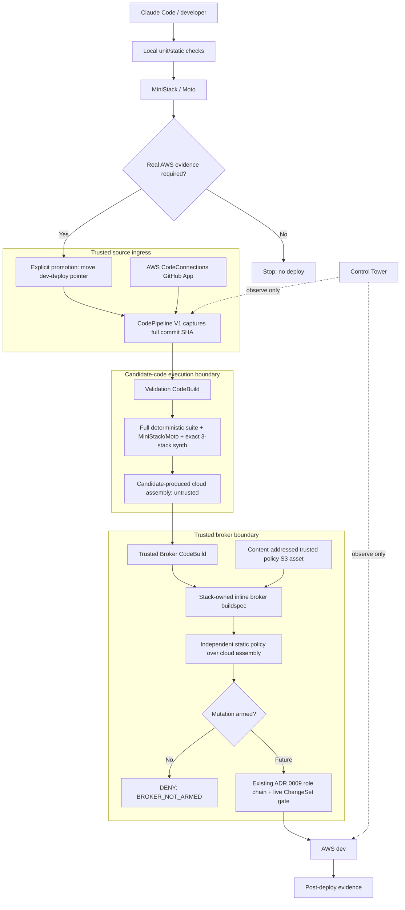

# AWS dev deploy broker — trusted control-plane boundary

Status: **Phase 1 / unarmed** · Tracking: #1146 · Foundation: `safe-dev-deploy`

This document is the architecture view for the sparse dev-deployment broker. Phase 1 is deliberately incapable of mutating the AWS dev workload.

## Architecture



## Branch strategy vs promotion strategy

`dev-deploy` is **not** a normal development branch and does not introduce GitFlow.

Normal work remains:

```text
short-lived feature/fix branch
  -> local checks / MiniStack
  -> PR
  -> main
```

Ordinary pushes, PR updates, and merges do not imply an AWS deploy.

When real AWS evidence is actually needed, the reviewed revision is promoted by moving the
`dev-deploy` pointer. CodePipeline Source captures the **full commit SHA that triggered that
execution** and exposes it as `OR_TRUSTED_SOURCE_REVISION` to both Validation and the Trusted
Broker.

From that point on the SHA, not the branch name, is the deployment identity:

```text
dev-deploy -> abc123...   (trigger only)
              |
              +-> source_revision = abc123...  (immutable for this execution)
                    -> Validation evidence
                    -> cloud assembly evaluation
                    -> sparse-deploy ledger / override
                    -> future ChangeSet/deploy
                    -> smoke/result
```

If `dev-deploy` moves to another commit while an execution is running, that running execution
must continue using its originally captured SHA. Candidate-produced evidence claiming another
revision is rejected by the Trusted Broker.

Do not re-resolve `git rev-parse dev-deploy` or remote branch HEAD inside Validation/Broker.

## Authority split

Candidate code is allowed to execute only in **Validation CodeBuild**. That role does not have:

- `sts:AssumeRole` into the dev deploy chain;
- CloudFormation mutation permissions;
- CodeConnections token access;
- production or cross-project authority.

The GitHub App connection terminates in **CodePipeline Source**, so package lifecycle scripts or tests cannot request the GitHub connection token.

The **Trusted Broker CodeBuild** consumes the validation artifact as **untrusted input**. Its buildspec is embedded into the broker stack with CDK. The trusted cloud-assembly policy is a content-addressed S3 asset published when the human-managed broker stack is deployed, and only the broker role receives read access to that object.

A candidate commit can edit the TypeScript/policy source that proposes a future broker configuration, but that edit does not change the already-deployed broker. Updating the broker stack is bootstrap/human work. The broker never executes repository scripts with its privileged identity.

## Why the single-CodeBuild design was rejected

Giving a CodeBuild project deploy authority while it executes a candidate checkout makes repository code part of the authorization boundary. A candidate could alter any of these before the intended gate:

```text
buildspec.yml
package.json postinstall
test scripts
CDK application code
shell wrappers
```

The candidate could then call AWS APIs directly with the build role. Repository wrappers are therefore evidence helpers, not the privileged enforcement point.

## Current static policy

Before any future mutation role is assumed, the broker independently parses `infra/cdk.out/manifest.json` and the referenced templates with a stack-owned, dependency-free policy. Initial fail-closed checks include:

- exact stack allowlist: Web / WebMonitoring / CfMon only;
- exact account and per-stack region;
- unknown CloudFormation resource type = deny;
- NAT Gateway / EC2 / RDS / OpenSearch / MSK / EKS / ECS service / schedulers / event-source mappings / SQS = human gate by default;
- ordinary IAM roles require `OpenReceptionClaudeBoundary`;
- broad/unscoped/loop-capable IAM actions are denied;
- DynamoDB must be on-demand;
- S3 public access block must remain fully enabled;
- public Lambda Function URL shapes are allowlisted;
- product Lambda memory/concurrency is bounded;
- per-type and total resource-count ceilings;
- cloud-assembly template paths cannot escape the assembly root.

Validation evidence and the cloud assembly are still candidate-produced, so a green Validation build is **not** authorization.

## Phase 1 invariant

The pipeline still ends at `BROKER_NOT_ARMED`. The Trusted Broker role has no `sts:AssumeRole` or CloudFormation mutation permission. Static policy can pass and mutation still cannot occur.

## Before mutation can be armed

Required prerequisites:

1. #1149 merged/tested: origin-verify uses only the existing Secrets Manager-name/dynamic-reference path; no raw secret reaches Validation.
2. #1151 merged/tested: dev Server/Image Lambda concurrency is physically bounded at 5/2.
3. Trusted static policy tested against a real current cloud assembly; do **not** widen the allowlist merely to turn it green.
4. Sparse deploy ledger implemented (target 1 success/day, soft ceiling 2, third requires human override bound to the candidate revision).
5. Live CloudFormation ChangeSet evaluation remains in front of execution, preserving ADR 0009 removal/replacement/unknown-action defenses.
6. Only then may the Trusted Broker be allowed to assume the existing ADR 0009 entry-role chain, through a separately reviewed human/bootstrap change.

## Cost / frequency

The pipeline uses CodePipeline V1 and two `BUILD_GENERAL1_SMALL` CodeBuild projects, both with concurrency 1. The `dev-deploy` branch is a **promotion branch**, not a normal development branch. Normal pushes do not update it, so they do not start this pipeline.

The portfolio target remains one successful real-AWS dev deploy per project per local day, soft ceiling two. The third potential success requires a human override tied to that immutable source revision. The durable ledger is not implemented yet, so mutation remains unarmed.
