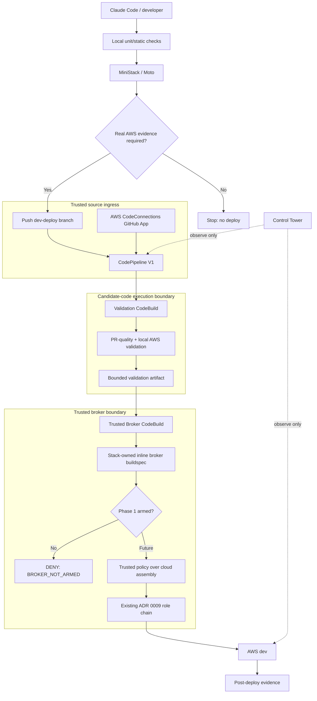

# AWS dev deploy broker — trusted control-plane boundary

Status: **Phase 1 / unarmed** · Tracking: #1146 · Foundation: `safe-dev-deploy`

This document is the architecture view for the sparse dev-deployment broker. Phase 1 is deliberately incapable of mutating the AWS dev workload.

## Architecture



## Authority split

Candidate code is allowed to execute only in **Validation CodeBuild**. That role does not have:

- `sts:AssumeRole` into the dev deploy chain;
- CloudFormation mutation permissions;
- CodeConnections token access;
- production or cross-project authority.

The GitHub App connection terminates in **CodePipeline Source**, so package lifecycle scripts or tests cannot request the GitHub connection token.

The **Trusted Broker CodeBuild** consumes only the validation artifact. Its buildspec is embedded into the broker stack with CDK. A candidate commit can edit the TypeScript source that proposes a future broker configuration, but that edit does not change the already-deployed broker. Updating the broker stack is bootstrap/human work.

## Why the single-CodeBuild design was rejected

Giving a CodeBuild project deploy authority while it executes a candidate checkout makes repository code part of the authorization boundary. A candidate could alter any of these before the intended gate:

```text
buildspec.yml
package.json postinstall
test scripts
CDK application code
shell wrappers
```

The candidate could then call AWS APIs directly with the build role. Repository wrappers are therefore evidence helpers, not the privileged enforcement point.

## Phase 1 invariant

The pipeline ends at `BROKER_NOT_ARMED`. The Trusted Broker role has no `sts:AssumeRole` or CloudFormation mutation permission. This is intentional and is pinned by CDK assertions.

## Before Phase 2 can be armed

The broker must first gain a trusted policy over an exact cloud assembly. The dev deployment context must also stop requiring the raw `OR_ORIGIN_VERIFY_SECRET` value during synth; use the existing Secrets Manager-name/dynamic-reference path instead. Only then can the Trusted Broker be allowed to assume the existing ADR 0009 entry-role chain.

## Cost / frequency

The pipeline uses CodePipeline V1 and two `BUILD_GENERAL1_SMALL` CodeBuild projects, both with concurrency 1. The `dev-deploy` branch is a **promotion branch**, not a normal development branch. Normal pushes do not update it, so they do not start this pipeline.

The portfolio target remains one successful real-AWS dev deploy per project per local day, soft ceiling two; the trusted sparse-deploy ledger is Phase 2.
