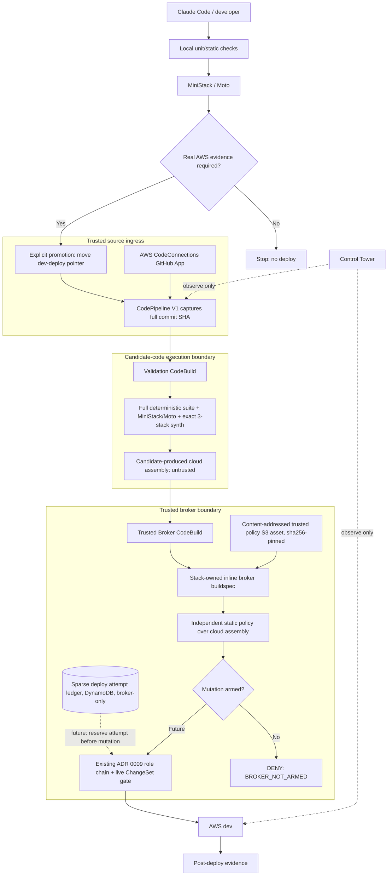

# AWS dev deploy broker — trusted control-plane boundary

Status: **Phase 1 / unarmed** · Tracking: #1146 · Foundation: `safe-dev-deploy`

This document is the architecture view for the sparse dev-deployment broker. Phase 1 is deliberately incapable of mutating the AWS dev workload.

## Architecture


```mermaid
flowchart TD
  A[Claude Code / developer] --> B[Local unit/static checks]
  B --> C[MiniStack / Moto]
  C --> D{Real AWS evidence required?}
  D -- No --> E[Stop: no deploy]
  D -- Yes --> F[Explicit promotion: move dev-deploy pointer]

  subgraph TRUSTED_INGRESS[Trusted source ingress]
    F --> G[CodePipeline V1 captures full commit SHA]
    H[AWS CodeConnections GitHub App] --> G
  end

  subgraph UNTRUSTED[Candidate-code execution boundary]
    G --> I[Validation CodeBuild]
    I --> J[Full deterministic suite + MiniStack/Moto + exact 3-stack synth]
    J --> K[Candidate-produced cloud assembly: untrusted]
  end

  subgraph TRUSTED_BROKER[Trusted broker boundary]
    K --> L[Trusted Broker CodeBuild]
    L --> M[Stack-owned inline broker buildspec]
    U[Content-addressed trusted policy S3 asset, sha256-pinned] --> M
    M --> P[Independent static policy over cloud assembly]
    P --> N{Mutation armed?}
    V[(Sparse deploy attempt ledger, DynamoDB, broker-only)] -. future: reserve attempt before mutation .-> Q
    N -- No --> O[DENY: BROKER_NOT_ARMED]
    N -- Future --> Q[Existing ADR 0009 role chain + live ChangeSet gate]
  end

  Q --> R[AWS dev]
  R --> S[Post-deploy evidence]

  T[Control Tower] -. observe only .-> G
  T -. observe only .-> R
```

## Synthesized resource names

The names below are what `DevDeployBrokerStack` synthesizes. `infra/test/dev-deploy-broker-invariants.test.ts`
fails when this list and the synthesized template diverge (a repository-side drift check; the
broker-side S8 enforcement from the Foundation contract is **not** implemented yet).

<!-- broker-resource-names:start -->
| Kind | Name |
| --- | --- |
| CodePipeline (V1) | `OpenReceptionSparseDevDeploy` |
| Stage | `Source` |
| Stage | `Validate` |
| Stage | `BrokerBoundary` |
| Action | `Source/PromotionBranch` |
| Action | `Validate/UnprivilegedValidation` |
| Action | `BrokerBoundary/TrustedBrokerUnarmed` |
| CodeBuild (candidate code) | `OpenReceptionDevDeployValidation` |
| CodeBuild (trusted broker) | `OpenReceptionTrustedDevDeployBroker` |
| IAM role (validation) | `OpenReceptionDevDeployValidationRole` |
| IAM role (broker) | `OpenReceptionTrustedDevDeployBrokerRole` |
<!-- broker-resource-names:end -->

## Branch strategy vs promotion strategy

`dev-deploy` is **not** a normal development branch and does not introduce GitFlow.

Normal work remains:

```text
short-lived feature/fix branch
  -> local checks / MiniStack
  -> PR
  -> main
```

Ordinary pushes, PR updates, and merges do not imply an AWS deploy.

When real AWS evidence is actually needed, the reviewed revision is promoted by moving the
`dev-deploy` pointer. CodePipeline Source captures the **full commit SHA that triggered that
execution** and exposes it as `OR_TRUSTED_SOURCE_REVISION` to both Validation and the Trusted
Broker.

From that point on the SHA, not the branch name, is the deployment identity:

```text
dev-deploy -> abc123...   (trigger only)
              |
              +-> source_revision = abc123...  (immutable for this execution)
                    -> Validation evidence
                    -> cloud assembly evaluation
                    -> sparse-deploy ledger / override
                    -> future ChangeSet/deploy
                    -> smoke/result
```

If `dev-deploy` moves to another commit while an execution is running, that running execution
must continue using its originally captured SHA. Candidate-produced evidence claiming another
revision is rejected by the Trusted Broker.

Do not re-resolve `git rev-parse dev-deploy` or remote branch HEAD inside Validation/Broker.

## Authority split

Candidate code is allowed to execute only in **Validation CodeBuild**. That role does not have:

- `sts:AssumeRole` into the dev deploy chain;
- CloudFormation mutation permissions;
- CodeConnections token access;
- production or cross-project authority.

The GitHub App connection terminates in **CodePipeline Source**, so package lifecycle scripts or tests cannot request the GitHub connection token.

The **Trusted Broker CodeBuild** consumes the validation artifact as **untrusted input**. Its buildspec is embedded into the broker stack with CDK. The trusted cloud-assembly policy is an S3 asset published when the human-managed broker stack is deployed. It lives in the **shared CDK bootstrap asset bucket** (`cdk-*-assets-<account>-<region>`), so the broker role is *not* the only principal that can read it, and any principal with write access to that bucket (e.g. CDK file-publishing roles, other stacks' deploy pipelines) could replace the object. Bucket access is therefore not the control. The control is a **content hash pin**: at synth the stack computes the SHA-256 of `infra/broker/trusted-policy.mjs` and injects it as `OR_TRUSTED_POLICY_SHA256`; the broker recomputes the SHA-256 of the downloaded file and fails closed (non-zero exit, no result file) on a missing/malformed pin or any mismatch **before** executing it. (The CDK asset fingerprint used in the object key is not a content hash of the file and is not used as the pin.)

A candidate commit can edit the TypeScript/policy source that proposes a future broker configuration, but that edit does not change the already-deployed broker. Updating the broker stack is bootstrap/human work. The broker never executes repository scripts with its privileged identity.

## Why the single-CodeBuild design was rejected

Giving a CodeBuild project deploy authority while it executes a candidate checkout makes repository code part of the authorization boundary. A candidate could alter any of these before the intended gate:

```text
buildspec.yml
package.json postinstall
test scripts
CDK application code
shell wrappers
```

The candidate could then call AWS APIs directly with the build role. Repository wrappers are therefore evidence helpers, not the privileged enforcement point.

## Current static policy

Before any future mutation role is assumed, the broker independently parses `infra/cdk.out/manifest.json` and the referenced templates with a stack-owned, dependency-free policy. Initial fail-closed checks include:

- exact stack allowlist: Web / WebMonitoring / CfMon only;
- exact account and per-stack region;
- unknown CloudFormation resource type = deny;
- NAT Gateway / EC2 / RDS / OpenSearch / MSK / EKS / ECS service / schedulers / event-source mappings / SQS = human gate by default;
- ordinary IAM roles require `OpenReceptionClaudeBoundary`;
- broad/unscoped/loop-capable IAM actions are denied;
- DynamoDB must be on-demand;
- S3 public access block must remain fully enabled;
- public Lambda Function URL shapes are allowlisted;
- product Lambda memory/concurrency is bounded;
- per-type and total resource-count ceilings;
- cloud-assembly template paths cannot escape the assembly root.

Validation evidence and the cloud assembly are still candidate-produced, so a green Validation build is **not** authorization.

## Phase 1 invariant

The pipeline still ends at `BROKER_NOT_ARMED`. The Trusted Broker role has no `sts:AssumeRole` or CloudFormation mutation permission. Static policy can pass and mutation still cannot occur.

### Phase 1 result shape (Foundation S11)

The unarmed broker writes `broker-result.json` (and prints it) with:
`result` (`denied`), `source_revision` (trusted CodePipeline `CommitId`, full 40-hex), `attempt_id`
(`CODEBUILD_BUILD_ID`, unique per attempt), `decided_at` (broker clock, RFC3339), `policy_version`
(`trusted-policy@<POLICY_VERSION>+sha256:<SHA-256 of the policy file content, verified before execution>`), `stage`, `rule` (`BROKER_NOT_ARMED`),
`resource`, `reason`, `retryable` (`false`), `evidence_ref`. A missing trusted revision, attempt id,
policy SHA-256 pin, a policy file whose SHA-256 differs from the pin, or a non-`allowed` policy
result writes no result and fails the build.
Delivering this result to GitHub is not implemented yet.

### Known residual risk (must be closed before arming)

**Status: addressed by blocker 2 below** (broker-side provenance of the exact S3 object versions);
what remains is that the Validation build itself runs candidate code, so the assembly is whatever the
promoted revision's code produced in that one build. The original analysis:

The revision check compares candidate-written evidence with the trusted `CommitId`. It rejects
stale/honest mismatches, but it is **not** a cryptographic binding of the cloud assembly to that
revision: candidate code in Validation can read `OR_TRUSTED_SOURCE_REVISION` and write matching
evidence. In addition, the Validation role (CDK default grant for the output artifact) can write and
delete any object in the pipeline artifact bucket, so candidate code of one execution could
overwrite another execution's artifacts. While unarmed this cannot mutate AWS; before arming, the
content that is deployed must be bound to the promoted revision independently of candidate-written
files (e.g. broker-side verification or a narrower artifact write scope).

### Phase 2 pre-arming blockers (recorded from adversarial review, not fixed in Phase 1)

These do not affect the unarmed Phase 1 (no mutation path exists), but each must be closed and
tested before the broker may assume any deploy role:

1. **Trusted policy approves dangerous assemblies.** The static policy currently lets through:
   cross-account / admin trust in role trust policies; a permissions boundary matched by substring
   instead of exact ARN; `NotAction` statements; `iam:PassRole` / `sts:AssumeRole` /
   `cloudformation:*` on wildcard-pattern resources such as `arn:aws:iam::*:role/*` (a bare
   `Resource: "*"` is flagged; the pattern form is not); a top-level template `Transform` (macros
   expand after review); deploy/lookup role ARNs in the manifest that point at a foreign account;
   nested cloud assemblies. It also never inspects a role's inline `Policies` or
   `ManagedPolicyArns`; exempts carve-out roles by logical ID alone (a candidate can reuse the
   id); accepts a Lambda `Role` given as a literal existing-role ARN; accepts `Custom::*` resources
   with an arbitrary `ServiceToken`; and does not check a `BucketPolicy` with `Principal: "*"` or a
   `Lambda::Permission` granted to a foreign account.
2. **Artifact bucket write/delete by the Validation role.** The CDK default grant lets candidate
   code of one execution overwrite or delete another execution's artifacts (cross-execution
   substitution). Needs per-execution write scope or broker-side content binding.
   **Status: closed in code (broker-side binding).** The artifact bucket is versioned; both build roles
   are explicitly denied deleting versions and changing versioning / lifecycle / bucket policy /
   replication. Before reading any candidate file, the broker runs `infra/broker/run-provenance.mjs`
   (stack asset, content SHA-256 verified like the policy) with read-only CodePipeline / CodeBuild / S3
   calls, and proceeds only if, for its own pipeline execution (`#{codepipeline.PipelineExecutionId}`):
   the Source action succeeded and recorded the trusted CommitId; exactly one Validate action succeeded in
   a succeeded build of the validation project; each action read exactly the object its predecessor wrote;
   and the source archive and the cloud assembly each have exactly one version, no delete marker, written
   while the producing action / build ran; and the build running the check is the broker action's own build.
   An overwrite by candidate code of another execution therefore leaves a second version and denies. The
   module then fetches **exactly that version** (`get-object --version-id`) into a fresh broker-owned
   directory, refuses unsafe archive entries (absolute, `..`, duplicate names) and anything but plain files
   and directories after extraction (no symlinks), and records its decision (with the archive's SHA-256)
   under a broker-owned output directory that must not exist beforehand. Every later gate reads only that
   materialized copy and writes only to that output directory; the broker never reads from or writes into
   the tree CodeBuild extracted (a candidate symlink there could otherwise redirect a write onto a verified
   module — found in adversarial review). Archive entry names must use the characters the real assembly
   uses, and the extracted files must be exactly the listed ones. Residual: CodeBuild's own download and
   extraction of the broker's input still happens before any broker command (so before this check); if that
   agent step were vulnerable to a crafted archive, it would run before provenance. Needs live verification
   at arming: that agent behaviour; the exact CodePipeline / CodeBuild response fields the check relies on
   (the in-progress broker action's `externalExecutionId` — if CodePipeline fills it only on completion, every
   run is denied and `GetPipelineState` is the fallback —, source `outputVariables.CommitId`, V1
   `sourceRevisions`); that the source zip's `LastModified` falls inside the source action's window; and the
   entry count of a real validated artifact (the synthesized assembly alone has about 4,600 entries; the
   limit is 50,000).
3. **No deploy-account pinning.** The target account is the stack's own `AWS::AccountId`; there is
   no independent, human-reviewed pin of the one dev account the broker may deploy to.
   **Status: pin established in code.** `DEV_DEPLOY_TARGET_ACCOUNT` is a reviewed constant equal to the account
   every ADR 0009 policy in `scripts/aws-policies/` pins (a test keeps them equal). A concrete synth for another
   account fails; both builds receive the literal (never `AWS::AccountId`); the trusted policy evaluates the
   assembly against it; and the broker's first command checks that its own build ARN is in that account. The pin in that check and the `--account` given to the trusted policy are literals in the stack-owned buildspec, not environment values, because a StartBuild `environmentVariablesOverride` (or an action-level override) can replace any environment variable.
   Binding the account the armed broker actually deploys to (manifest role ARNs, asset destinations) is the
   trusted policy's job (blocker 1) and must be re-checked when the role chain is armed (e.g. caller identity
   after AssumeRole).
4. **Stale retry reuses an old CommitId.** Retrying an old failed `BrokerBoundary` stage re-runs
   with that execution's original CommitId and artifacts, which may be long superseded; arming
   needs freshness (e.g. `dev-deploy` pointer / ledger check) before mutation.
   **Status: closed in code.** The same check requires the execution to be the newest of the pipeline
   (no other run has started since, which is how a moved promotion pointer shows up), still `InProgress`,
   recorded with the trusted revision, and started less than 12 hours ago (a test keeps this well inside
   the artifact retention). It does not read the branch head itself: if the pointer moved but no execution
   was triggered, a retry within 12 hours is still accepted. A retry inside the window is a new attempt
   (new build id) for the ledger, not the same one.
5. **Artifact bucket has no lifecycle rule.** Candidate artifacts accumulate indefinitely (cost and
   stale-artifact reuse surface).
   **Status: closed in code.** The pipeline uses an explicit artifact bucket (same protections as the CDK
   default: S3-managed encryption, all public access blocked, TLS only) whose lifecycle expires every object
   after `PIPELINE_ARTIFACT_RETENTION_DAYS` (7) and aborts incomplete uploads after 1 day.
6. **Fixed physical names + `RETAIN`.** Fixed role/project/log-group names with retained log
   groups cause name conflicts when the stack is deleted and recreated.
   **Status: closed in code.** The two retained log groups no longer have fixed names, and a test asserts
   that no retained resource (ledger table, log groups, artifact bucket) has a fixed physical name. Role,
   project and pipeline names stay fixed: they are deleted with the stack, so they cannot collide, and the
   future ADR 0009 trust needs a stable broker role ARN.

## Before mutation can be armed

Required prerequisites:

1. #1149 merged/tested: origin-verify uses only the existing Secrets Manager-name/dynamic-reference path; no raw secret reaches Validation.
2. #1151 merged/tested: dev Server/Image Lambda concurrency is physically bounded at 5/2.
3. Trusted static policy tested against a real current cloud assembly; do **not** widen the allowlist merely to turn it green.
4. Sparse deploy ledger implemented per Foundation safe-dev-deploy S6/S6b and the owner decision on #1153: record every attempt that reaches the mutation boundary and its outcome, count **attempts** against the daily limit (target 1, soft ceiling 2) over one declared IANA timezone (Asia/Tokyo), deny when the ledger is missing or unreadable (S6a), and allow a further attempt only through an S5a override bound to one revision **and one rule**, single-use, expiring and audited.
   **Status: implemented; delivery and denial audit wired, reservation not yet called** (`infra/broker/sparse-ledger.mjs`, `infra/broker/ledger-runner.mjs`, see "Sparse deploy attempt ledger" below). Calling `reserve` / `outcome` around the mutation is part of arming.

## Sparse deploy attempt ledger (#1153)

Semantics (Foundation S5a / S6 / S6a / S6b, owner decision on #1153):

| Item | Rule |
| --- | --- |
| What is counted | Every attempt that reaches the mutation boundary, reserved **before** mutation. Success and failure are both recorded; a failure keeps its budget. A denial before the boundary is audited and consumes nothing. |
| Window | Calendar day in `Asia/Tokyo`, recorded on every item. The caller's timezone is never used. |
| Ceiling | Attempts 1 and 2 of a day are automatic; attempt 3+ needs an override. |
| Override | Issued with the human override-issuer role (the stack parameter `SparseLedgerOverrideIssuerRoleArn`, chosen by the owner at deploy; never a Claude or candidate role), bound to one revision, the rule `SPARSE_DAILY_ATTEMPT_CEILING` only, the current Tokyo day, a reason and an approver, expiring within 24 h. **Create-only**: at most one per revision, rule and day, never replaced, so issued / consumed / expired-unused history survives. Consumed in the same transaction as the reservation; the attempt record copies its approver and reason. |
| Genesis | A human writes `META#genesis` once (create-only) with a ledger id that is also pinned in the broker's configuration. It carries a cumulative `totalAttempts`, the monotonic `lastDay` of the latest reservation and that day's count `lastDayAttempts`, all compare-and-set in every reservation transaction together with the day counter. A missing or different genesis item (table emptied or replaced), a counter for today that is missing, overwritten or decremented relative to `lastDayAttempts`, a day count above the total, or `lastDay` after today (clock regression) is `SPARSE_LEDGER_CORRUPT`, never "fresh day". The three items are read in one `TransactGetItems` snapshot, so a concurrent reservation cannot make them look inconsistent. |
| Fail closed | Unreadable ledger → `SPARSE_LEDGER_UNAVAILABLE`; missing genesis or inconsistent counter (wrong type, other timezone/day, more outcomes than attempts) → `SPARSE_LEDGER_CORRUPT`; refused reservation (race, reused attempt id, override no longer valid) → `SPARSE_LEDGER_CONFLICT`; invalid broker clock → `BROKER_CLOCK_INVALID`. None is retried automatically. Every denial is written as an `ATTEMPT#` audit record (best-effort; a failed audit write never turns a denial into an allow). |

Items (one table, `PK = PROJECT#open-reception`): `META#genesis`, `DAY#<YYYY-MM-DD>` (attempt / success / failure counts), `ATTEMPT#<attempt id>` (audit record), `OVERRIDE#<rule>#<revision>#<day>`.

Every write is conditional and re-checked by DynamoDB, not only by the JS decision: the day counter is compare-and-set on the observed attempt count, attempt / override / genesis records are create-only, and override consumption re-checks revision, rule, day, expiry and "not yet consumed". `infra/test/sparse-dev-deploy-ledger.emulator.test.ts` runs these against a real DynamoDB engine (emulator), including an empty table without genesis, overwritten / deleted counters, a stale cumulative total, and engine-only refusal of an expired or consumed override:

```bash
# in infra/, with any DynamoDB emulator on loopback (e.g. npm run aws:local:start)
LOCAL_AWS_INTEGRATION=1 AWS_ENDPOINT_URL=http://127.0.0.1:4566 \
  npx vitest run test/sparse-dev-deploy-ledger.emulator.test.ts
```

The two concurrency cases (12 racers per round; 10 racers on one override) need real transaction isolation and run only with `LEDGER_TX_ISOLATION=1` against DynamoDB Local. moto's `transact_write_items` restores a pre-transaction copy of the table when a transaction fails, which can erase another racer's committed write (lost update), so moto results are not concurrency evidence.

```bash
java -Djava.library.path=./DynamoDBLocal_lib -jar DynamoDBLocal.jar -inMemory -port 8000
LOCAL_AWS_INTEGRATION=1 LEDGER_TX_ISOLATION=1 AWS_ENDPOINT_URL=http://127.0.0.1:8000 \
  npx vitest run test/sparse-dev-deploy-ledger.emulator.test.ts
```

Who can write the ledger. The ledger lives in the same account as the dev workload, so stack-local IAM is not enough. Three layers, each pinned by a test:

1. **Table resource policy** denies every data-plane write (`PutItem`, `UpdateItem`, `DeleteItem`, `BatchWriteItem`, PartiQL writes) to every principal except the broker role and the override-issuer role, and every configuration change that could reset or unprotect the ledger (`UpdateTimeToLive` — TTL on a counter attribute deletes items —, `Put/DeleteResourcePolicy`, `UpdateTable`, `DeleteTable`, backup / restore / streaming settings) to every principal except the override-issuer role and the human stack-deploy role (stack parameter `SparseLedgerStackDeployRoleArn`, the CloudFormation execution role a human uses to deploy this stack). This covers principals outside the Claude boundary too, e.g. other projects' workloads in the same account (`dev-deploy-broker-invariants.test.ts`).
2. **Claude boundary and CFN exec policies** (`scripts/aws-policies/claude-boundary*.json`, `claude-cfn-exec*.json`) deny `dynamodb:*` on `table/OpenReception-DevDeployBroker-*` and `cloudformation:*` on the `OpenReception-DevDeployBroker` stack (folded into the existing `DenyForeignProjectData` / `DenyForeignProjectStacks` statements; the boundary is near IAM's 6,144-character limit), so neither Claude's deploy chain nor any workload role created under the boundary can write, reconfigure (`UpdateTable` / deletion protection) or delete it. The table has no fixed name; CloudFormation names it `<stack name>-...`, which the test ties to the stack name in `bin/dev-deploy-broker.ts`. Applying these policy files to the account is a separate human step.
3. **Trusted static policy**. For every Allow statement that can grant a DynamoDB action (the service part of any action glob-matches `dynamodb`: `dynamodb:*`, `dynamo*`, `*`, `*:UpdateItem`, `dynamod?:PutItem`; any `NotAction`; any non-literal action), each resource must be either a literal ARN that cannot match the ledger table (matched segment by segment like IAM: partition and service are glob-matched, region and account always count as matching, and the resource part must not be able to match any string starting with `table/OpenReception-DevDeployBroker-`, so globs on the ledger's deterministic name hash or a mangled `table/` literal are caught; a short or malformed ARN containing a wildcard fails closed; no `{{resolve:` dynamic reference and no IAM policy variable `${...}`, which a candidate could steer through its own role tags), or a reference whose value the service fixes: `GetAtt` / `Ref` of a resource declared in the same template **of a reviewed type** (DynamoDB table, S3 bucket, Lambda function, log group, IAM role, SNS topic, SQS queue, Cognito user pool), or CDK's `Join(GetAtt, "/index/*")`. Custom resources (whose values the provider Lambda chooses), parameters, mappings, imports, `Fn::Sub`, `Fn::Select` and the like cannot be resolved and fail closed (`IAM_REACHES_SPARSE_LEDGER`). A statement that is not a plain object with a literal `Effect` (e.g. `Fn::If`) is `IAM_POLICY_OPAQUE`. Statements without DynamoDB actions (e.g. the Web stack's Cost Explorer `Resource: "*"`) are not affected. Any Allow with `NotResource` is rejected (`IAM_NOT_RESOURCE`), and role `ManagedPolicyArns` must be reviewed AWS-managed policies (today only `AWSLambdaBasicExecutionRole`: `IAM_MANAGED_POLICY_NOT_REVIEWED`). The checks apply to standalone policies and to role inline `Policies`, including CDK carve-out roles. Evaluated against the real dev assembly (`bin/open-reception.ts` synthesized without credentials), none of these rules fires; the only violations are the pre-existing ones listed as pre-arming blockers.

The broker role itself gets only `dynamodb:GetItem` / `PutItem` / `UpdateItem` on the table, for the `PROJECT#open-reception` partition (`dynamodb:LeadingKeys`); no Delete, Scan, Query or table management. The Validation role and every other role in the stack have no statement on it.

Not done yet (arming work, Human Gate):

- Wiring. **Done except the reservation call.** `sparse-ledger.mjs` and `ledger-runner.mjs` are stack assets whose content SHA-256 the broker verifies before any gate (like the trusted policy), never taken from the candidate artifact. The runner reaches DynamoDB through the CLI already in the broker image (`aws dynamodb <op> --cli-input-json`, no shell, no SDK install); a refused conditional write is recognised from the CLI's error text, anything else counts as unavailable. The ledger id is the stack parameter `SparseLedgerId` (same pattern as the module; the human-written genesis must carry it). Remaining at arming: `ledger-runner.mjs reserve` strictly **after** every other deny-capable gate (static policy, live ChangeSet evaluation) and immediately before mutation, and `outcome` after it, because a reserved attempt has consumed budget and its only outcomes are succeeded / failed. `reserve` exits non-zero on any denial, including an unreadable ledger, an ambiguous write (`ledger.reserve_ambiguous`), a reservation whose local record cannot be written and a second `reserve` in the same build. At arming, gate the mutation on both the exit code and the reservation record (`/tmp/open-reception-ledger/reservation.json` naming `$CODEBUILD_BUILD_ID`). The runner runs as a program even through a symlinked path (realpath comparison), resolves the CLI only from absolute PATH entries (the working directory is the candidate tree), and passes each request through a private file (`--cli-input-json file://...`), so a long override reason cannot hit the argument-length limit. Only a transport / server-side failure is flagged as possibly committed (`ambiguous`).
- The human commands (genesis, override issuance), the issuer role, and choosing the two role ARN parameters (owner, at deploy). The parameters refuse, by pattern on the role name (after any path), `cdk-orcloud01-*`, every `OpenReception*` role (Claude's entry / deploy roles, this stack's broker / validation roles, candidate workload roles) and other projects' workload prefixes (`nodi-`, `salon-loop-`, `Kiaff`), so the issuer role must be named outside those prefixes. If a wrong role is supplied anyway, the table's resource policy can block the stack's own create / update (e.g. enabling PITR). Recovery: the account root user can always call `DeleteResourcePolicy` on the table (DynamoDB keeps this path so the account cannot lock itself out), then redeploy with the right parameter. Resource policies are not drift-detected.
- Genesis must be written with the current `buildGenesisPut` (with `totalAttempts: 0`); none has been written yet.
- Earlier gates' denials are audited with `recordDenial`. **Done:** before each gate the buildspec names it in a broker-owned marker file (`/tmp/open-reception-ledger/gate`: `BROKER_MODULE_INTEGRITY` around every trusted-module download and hash check, then `TRUSTED_PROVENANCE_DENIED`, `TRUSTED_REVISION_MISMATCH`, `TRUSTED_POLICY_DENIED`, `BROKER_NOT_ARMED`), and the build phase's `finally` — only when `CODEBUILD_BUILD_SUCCEEDING` is 0 — re-verifies both ledger files and runs `ledger-runner.mjs deny`, which records the gate that stopped the build (anything else is `BROKER_GATE_UNKNOWN`) as `denied_before_mutation`. Best-effort: it never changes the failed build and never runs unverified files; once `reserve` has started, `reserve` owns the attempt's audit and `deny` records nothing; an attempt already recorded is reported as such. Not audited: failures before the ledger files are verified (account pin, output dir, the ledger downloads). If `reserve`'s own denial audit fails (`audited: false`) the denial is only in the build log. Needs live verification: that `CODEBUILD_BUILD_SUCCEEDING` is already 0 inside the failing build phase's own `finally` (if it is not, this audit is silently off; the fallback is a completion marker written only by a successful path), whether CodeBuild runs `finally` after a timeout or a stop (if not, those attempts need an out-of-band audit), the real CLI's exit-code mapping (255 transport, 254 service) that the ambiguity flag relies on, the real CLI's stderr format for refused conditions, and that the CLI fills `ClientRequestToken` for `transact-write-items` so its own retry after a lost response is idempotent.
- An ambiguous reservation failure (network error after DynamoDB committed) is reported as `SPARSE_LEDGER_UNAVAILABLE` while an `in_progress` attempt that never mutated holds budget. This fails safe; wiring must alert on `in_progress` attempts older than the broker timeout.
- One override per revision, rule and day: after it is consumed, a further attempt of the same revision that day cannot be allowed even by a human (fail closed). Confirm with the owner whether that is intended.
- CloudTrail data events on the table, so the real principal behind each override is recorded. The `approver` attribute is written by the issuer and is not itself authenticated.
- S10a: a failed-rollback environment blocks further automated attempts; repeated failures on one revision escalate.
- IAM cannot restrict the sort key, so the broker role could technically write an `OVERRIDE#` item. The broker is trusted code and never issues overrides.
5. Live CloudFormation ChangeSet evaluation remains in front of execution, preserving ADR 0009 removal/replacement/unknown-action defenses.
6. Only then may the Trusted Broker be allowed to assume the existing ADR 0009 entry-role chain, through a separately reviewed human/bootstrap change.

## Cost / frequency

The pipeline uses CodePipeline V1 and two `BUILD_GENERAL1_SMALL` CodeBuild projects, both with concurrency 1. The `dev-deploy` branch is a **promotion branch**, not a normal development branch. Normal pushes do not update it, so they do not start this pipeline.

The portfolio target is one real-AWS dev deploy **attempt** per project per accounting day (Asia/Tokyo), soft ceiling two, counting every attempt that reaches the mutation boundary whether it succeeds or fails (Foundation S6/S6b; owner decision recorded on #1153). A third attempt requires an S5a override bound to that immutable source revision and to the daily-limit rule only. The durable ledger is implemented (#1153) but not wired into the broker, so mutation remains unarmed.
