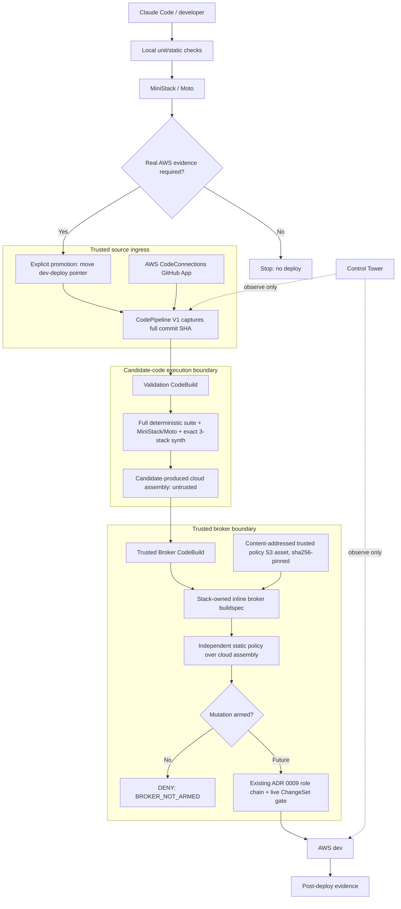

# AWS dev deploy broker — trusted control-plane boundary

Status: **Phase 1 / unarmed** · Tracking: #1146 · Foundation: `safe-dev-deploy`

This document is the architecture view for the sparse dev-deployment broker. Phase 1 is deliberately incapable of mutating the AWS dev workload.

## Architecture


```mermaid
flowchart TD
  A[Claude Code / developer] --> B[Local unit/static checks]
  B --> C[MiniStack / Moto]
  C --> D{Real AWS evidence required?}
  D -- No --> E[Stop: no deploy]
  D -- Yes --> F[Explicit promotion: move dev-deploy pointer]

  subgraph TRUSTED_INGRESS[Trusted source ingress]
    F --> G[CodePipeline V1 captures full commit SHA]
    H[AWS CodeConnections GitHub App] --> G
  end

  subgraph UNTRUSTED[Candidate-code execution boundary]
    G --> I[Validation CodeBuild]
    I --> J[Full deterministic suite + MiniStack/Moto + exact 3-stack synth]
    J --> K[Candidate-produced cloud assembly: untrusted]
  end

  subgraph TRUSTED_BROKER[Trusted broker boundary]
    K --> L[Trusted Broker CodeBuild]
    L --> M[Stack-owned inline broker buildspec]
    U[Content-addressed trusted policy S3 asset, sha256-pinned] --> M
    M --> P[Independent static policy over cloud assembly]
    P --> N{Mutation armed?}
    N -- No --> O[DENY: BROKER_NOT_ARMED]
    N -- Future --> Q[Existing ADR 0009 role chain + live ChangeSet gate]
  end

  Q --> R[AWS dev]
  R --> S[Post-deploy evidence]

  T[Control Tower] -. observe only .-> G
  T -. observe only .-> R
```

## Synthesized resource names

The names below are what `DevDeployBrokerStack` synthesizes. `infra/test/dev-deploy-broker-invariants.test.ts`
fails when this list and the synthesized template diverge (a repository-side drift check; the
broker-side S8 enforcement from the Foundation contract is **not** implemented yet).

<!-- broker-resource-names:start -->
| Kind | Name |
| --- | --- |
| CodePipeline (V1) | `OpenReceptionSparseDevDeploy` |
| Stage | `Source` |
| Stage | `Validate` |
| Stage | `BrokerBoundary` |
| Action | `Source/PromotionBranch` |
| Action | `Validate/UnprivilegedValidation` |
| Action | `BrokerBoundary/TrustedBrokerUnarmed` |
| CodeBuild (candidate code) | `OpenReceptionDevDeployValidation` |
| CodeBuild (trusted broker) | `OpenReceptionTrustedDevDeployBroker` |
| IAM role (validation) | `OpenReceptionDevDeployValidationRole` |
| IAM role (broker) | `OpenReceptionTrustedDevDeployBrokerRole` |
<!-- broker-resource-names:end -->

## Branch strategy vs promotion strategy

`dev-deploy` is **not** a normal development branch and does not introduce GitFlow.

Normal work remains:

```text
short-lived feature/fix branch
  -> local checks / MiniStack
  -> PR
  -> main
```

Ordinary pushes, PR updates, and merges do not imply an AWS deploy.

When real AWS evidence is actually needed, the reviewed revision is promoted by moving the
`dev-deploy` pointer. CodePipeline Source captures the **full commit SHA that triggered that
execution** and exposes it as `OR_TRUSTED_SOURCE_REVISION` to both Validation and the Trusted
Broker.

From that point on the SHA, not the branch name, is the deployment identity:

```text
dev-deploy -> abc123...   (trigger only)
              |
              +-> source_revision = abc123...  (immutable for this execution)
                    -> Validation evidence
                    -> cloud assembly evaluation
                    -> sparse-deploy ledger / override
                    -> future ChangeSet/deploy
                    -> smoke/result
```

If `dev-deploy` moves to another commit while an execution is running, that running execution
must continue using its originally captured SHA. Candidate-produced evidence claiming another
revision is rejected by the Trusted Broker.

Do not re-resolve `git rev-parse dev-deploy` or remote branch HEAD inside Validation/Broker.

## Authority split

Candidate code is allowed to execute only in **Validation CodeBuild**. That role does not have:

- `sts:AssumeRole` into the dev deploy chain;
- CloudFormation mutation permissions;
- CodeConnections token access;
- production or cross-project authority.

The GitHub App connection terminates in **CodePipeline Source**, so package lifecycle scripts or tests cannot request the GitHub connection token.

The **Trusted Broker CodeBuild** consumes the validation artifact as **untrusted input**. Its buildspec is embedded into the broker stack with CDK. The trusted cloud-assembly policy is an S3 asset published when the human-managed broker stack is deployed. It lives in the **shared CDK bootstrap asset bucket** (`cdk-*-assets-<account>-<region>`), so the broker role is *not* the only principal that can read it, and any principal with write access to that bucket (e.g. CDK file-publishing roles, other stacks' deploy pipelines) could replace the object. Bucket access is therefore not the control. The control is a **content hash pin**: at synth the stack computes the SHA-256 of `infra/broker/trusted-policy.mjs` and injects it as `OR_TRUSTED_POLICY_SHA256`; the broker recomputes the SHA-256 of the downloaded file and fails closed (non-zero exit, no result file) on a missing/malformed pin or any mismatch **before** executing it. (The CDK asset fingerprint used in the object key is not a content hash of the file and is not used as the pin.)

A candidate commit can edit the TypeScript/policy source that proposes a future broker configuration, but that edit does not change the already-deployed broker. Updating the broker stack is bootstrap/human work. The broker never executes repository scripts with its privileged identity.

## Why the single-CodeBuild design was rejected

Giving a CodeBuild project deploy authority while it executes a candidate checkout makes repository code part of the authorization boundary. A candidate could alter any of these before the intended gate:

```text
buildspec.yml
package.json postinstall
test scripts
CDK application code
shell wrappers
```

The candidate could then call AWS APIs directly with the build role. Repository wrappers are therefore evidence helpers, not the privileged enforcement point.

## Current static policy

Before any future mutation role is assumed, the broker independently parses `infra/cdk.out/manifest.json` and the referenced templates with a stack-owned, dependency-free policy. Initial fail-closed checks include:

- exact stack allowlist: Web / WebMonitoring / CfMon only;
- exact account and per-stack region;
- unknown CloudFormation resource type = deny;
- NAT Gateway / EC2 / RDS / OpenSearch / MSK / EKS / ECS service / schedulers / event-source mappings / SQS = human gate by default;
- ordinary IAM roles require `OpenReceptionClaudeBoundary`;
- broad/unscoped/loop-capable IAM actions are denied;
- DynamoDB must be on-demand;
- S3 public access block must remain fully enabled;
- public Lambda Function URL shapes are allowlisted;
- product Lambda memory/concurrency is bounded;
- per-type and total resource-count ceilings;
- cloud-assembly template paths cannot escape the assembly root.

Validation evidence and the cloud assembly are still candidate-produced, so a green Validation build is **not** authorization.

## Phase 1 invariant

The pipeline still ends at `BROKER_NOT_ARMED`. The Trusted Broker role has no `sts:AssumeRole` or CloudFormation mutation permission. Static policy can pass and mutation still cannot occur.

### Phase 1 result shape (Foundation S11)

The unarmed broker writes `broker-result.json` (and prints it) with:
`result` (`denied`), `source_revision` (trusted CodePipeline `CommitId`, full 40-hex), `attempt_id`
(`CODEBUILD_BUILD_ID`, unique per attempt), `decided_at` (broker clock, RFC3339), `policy_version`
(`trusted-policy@<POLICY_VERSION>+sha256:<SHA-256 of the policy file content, verified before execution>`), `stage`, `rule` (`BROKER_NOT_ARMED`),
`resource`, `reason`, `retryable` (`false`), `evidence_ref`. A missing trusted revision, attempt id,
policy SHA-256 pin, a policy file whose SHA-256 differs from the pin, or a non-`allowed` policy
result writes no result and fails the build.
Delivering this result to GitHub is not implemented yet.

### Known residual risk (must be closed before arming)

The revision check compares candidate-written evidence with the trusted `CommitId`. It rejects
stale/honest mismatches, but it is **not** a cryptographic binding of the cloud assembly to that
revision: candidate code in Validation can read `OR_TRUSTED_SOURCE_REVISION` and write matching
evidence. In addition, the Validation role (CDK default grant for the output artifact) can write and
delete any object in the pipeline artifact bucket, so candidate code of one execution could
overwrite another execution's artifacts. While unarmed this cannot mutate AWS; before arming, the
content that is deployed must be bound to the promoted revision independently of candidate-written
files (e.g. broker-side verification or a narrower artifact write scope).

### Phase 2 pre-arming blockers (recorded from adversarial review, not fixed in Phase 1)

These do not affect the unarmed Phase 1 (no mutation path exists), but each must be closed and
tested before the broker may assume any deploy role:

1. **Trusted policy approves dangerous assemblies.** The static policy currently lets through:
   cross-account / admin trust in role trust policies; a permissions boundary matched by substring
   instead of exact ARN; `NotAction` statements; `iam:PassRole` / `sts:AssumeRole` /
   `cloudformation:*` on `*`; a top-level template `Transform` (macros expand after review);
   deploy/lookup role ARNs in the manifest that point at a foreign account; nested cloud assemblies.
2. **Artifact bucket write/delete by the Validation role.** The CDK default grant lets candidate
   code of one execution overwrite or delete another execution's artifacts (cross-execution
   substitution). Needs per-execution write scope or broker-side content binding.
3. **No deploy-account pinning.** The target account is the stack's own `AWS::AccountId`; there is
   no independent, human-reviewed pin of the one dev account the broker may deploy to.
4. **Stale retry reuses an old CommitId.** Retrying an old failed `BrokerBoundary` stage re-runs
   with that execution's original CommitId and artifacts, which may be long superseded; arming
   needs freshness (e.g. `dev-deploy` pointer / ledger check) before mutation.
5. **Artifact bucket has no lifecycle rule.** Candidate artifacts accumulate indefinitely (cost and
   stale-artifact reuse surface).
6. **Fixed physical names + `RETAIN`.** Fixed role/project/log-group names with retained log
   groups cause name conflicts when the stack is deleted and recreated.

## Before mutation can be armed

Required prerequisites:

1. #1149 merged/tested: origin-verify uses only the existing Secrets Manager-name/dynamic-reference path; no raw secret reaches Validation.
2. #1151 merged/tested: dev Server/Image Lambda concurrency is physically bounded at 5/2.
3. Trusted static policy tested against a real current cloud assembly; do **not** widen the allowlist merely to turn it green.
4. Sparse deploy ledger implemented (target 1 success/day, soft ceiling 2, third requires human override bound to the candidate revision).
5. Live CloudFormation ChangeSet evaluation remains in front of execution, preserving ADR 0009 removal/replacement/unknown-action defenses.
6. Only then may the Trusted Broker be allowed to assume the existing ADR 0009 entry-role chain, through a separately reviewed human/bootstrap change.

## Cost / frequency

The pipeline uses CodePipeline V1 and two `BUILD_GENERAL1_SMALL` CodeBuild projects, both with concurrency 1. The `dev-deploy` branch is a **promotion branch**, not a normal development branch. Normal pushes do not update it, so they do not start this pipeline.

The portfolio target remains one successful real-AWS dev deploy per project per local day, soft ceiling two. The third potential success requires a human override tied to that immutable source revision. The durable ledger is not implemented yet, so mutation remains unarmed.
