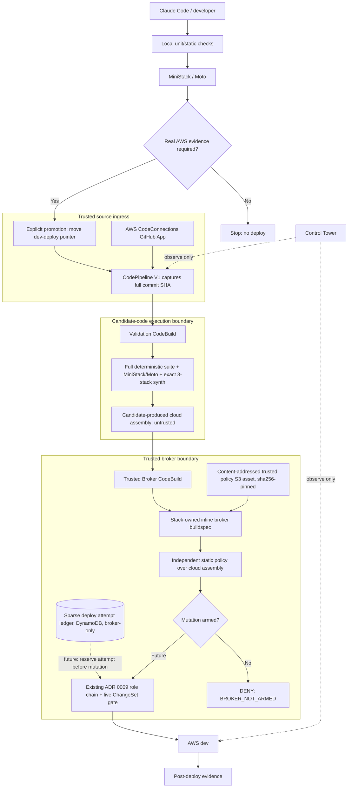

# AWS dev deploy broker — trusted control-plane boundary

Status: **Phase 1 / unarmed** · Tracking: #1146 · Foundation: `safe-dev-deploy`

This document is the architecture view for the sparse dev-deployment broker. Phase 1 is deliberately incapable of mutating the AWS dev workload.

## Architecture


```mermaid
flowchart TD
  A[Claude Code / developer] --> B[Local unit/static checks]
  B --> C[MiniStack / Moto]
  C --> D{Real AWS evidence required?}
  D -- No --> E[Stop: no deploy]
  D -- Yes --> F[Explicit promotion: move dev-deploy pointer]

  subgraph TRUSTED_INGRESS[Trusted source ingress]
    F --> G[CodePipeline V1 captures full commit SHA]
    H[AWS CodeConnections GitHub App] --> G
  end

  subgraph UNTRUSTED[Candidate-code execution boundary]
    G --> I[Validation CodeBuild]
    I --> J[Full deterministic suite + MiniStack/Moto + exact 3-stack synth]
    J --> K[Candidate-produced cloud assembly: untrusted]
  end

  subgraph TRUSTED_BROKER[Trusted broker boundary]
    K --> L[Trusted Broker CodeBuild]
    L --> M[Stack-owned inline broker buildspec]
    U[Content-addressed trusted policy S3 asset, sha256-pinned] --> M
    M --> P[Independent static policy over cloud assembly]
    P --> N{Mutation armed?}
    V[(Sparse deploy attempt ledger, DynamoDB, broker-only)] -. future: reserve attempt before mutation .-> Q
    N -- No --> O[DENY: BROKER_NOT_ARMED]
    N -- Future --> Q[Existing ADR 0009 role chain + live ChangeSet gate]
  end

  Q --> R[AWS dev]
  R --> S[Post-deploy evidence]

  T[Control Tower] -. observe only .-> G
  T -. observe only .-> R
```

## Synthesized resource names

The names below are what `DevDeployBrokerStack` synthesizes. `infra/test/dev-deploy-broker-invariants.test.ts`
fails when this list and the synthesized template diverge (a repository-side drift check; the
broker-side S8 enforcement from the Foundation contract is **not** implemented yet).

<!-- broker-resource-names:start -->
| Kind | Name |
| --- | --- |
| CodePipeline (V1) | `OpenReceptionSparseDevDeploy` |
| Stage | `Source` |
| Stage | `Validate` |
| Stage | `BrokerBoundary` |
| Action | `Source/PromotionBranch` |
| Action | `Validate/UnprivilegedValidation` |
| Action | `BrokerBoundary/TrustedBrokerUnarmed` |
| CodeBuild (candidate code) | `OpenReceptionDevDeployValidation` |
| CodeBuild (trusted broker) | `OpenReceptionTrustedDevDeployBroker` |
| IAM role (validation) | `OpenReceptionDevDeployValidationRole` |
| IAM role (broker) | `OpenReceptionTrustedDevDeployBrokerRole` |
<!-- broker-resource-names:end -->

## Branch strategy vs promotion strategy

`dev-deploy` is **not** a normal development branch and does not introduce GitFlow.

Normal work remains:

```text
short-lived feature/fix branch
  -> local checks / MiniStack
  -> PR
  -> main
```

Ordinary pushes, PR updates, and merges do not imply an AWS deploy.

When real AWS evidence is actually needed, the reviewed revision is promoted by moving the
`dev-deploy` pointer. CodePipeline Source captures the **full commit SHA that triggered that
execution** and exposes it as `OR_TRUSTED_SOURCE_REVISION` to both Validation and the Trusted
Broker.

From that point on the SHA, not the branch name, is the deployment identity:

```text
dev-deploy -> abc123...   (trigger only)
              |
              +-> source_revision = abc123...  (immutable for this execution)
                    -> Validation evidence
                    -> cloud assembly evaluation
                    -> sparse-deploy ledger / override
                    -> future ChangeSet/deploy
                    -> smoke/result
```

If `dev-deploy` moves to another commit while an execution is running, that running execution
must continue using its originally captured SHA. Candidate-produced evidence claiming another
revision is rejected by the Trusted Broker.

Do not re-resolve `git rev-parse dev-deploy` or remote branch HEAD inside Validation/Broker.

## Authority split

Candidate code is allowed to execute only in **Validation CodeBuild**. That role does not have:

- `sts:AssumeRole` into the dev deploy chain;
- CloudFormation mutation permissions;
- CodeConnections token access;
- production or cross-project authority.

The GitHub App connection terminates in **CodePipeline Source**, so package lifecycle scripts or tests cannot request the GitHub connection token.

The **Trusted Broker CodeBuild** consumes the validation artifact as **untrusted input**. Its buildspec is embedded into the broker stack with CDK. The trusted cloud-assembly policy is an S3 asset published when the human-managed broker stack is deployed. It lives in the CDK bootstrap asset bucket (`cdk-<qualifier>-assets-<account>-<region>`). Since blocker 8 the broker has a bootstrap of its own (`orbrkr01`): its publishing role trusts only the owner, and the Claude chain is denied that bucket. Still, the broker role is *not* the only principal that can read the bucket, and an account admin could replace the object. Bucket access is therefore not the control. The control is a **content hash pin**: at synth the stack computes the SHA-256 of `infra/broker/trusted-policy.mjs` and injects it as `OR_TRUSTED_POLICY_SHA256`; the broker recomputes the SHA-256 of the downloaded file and fails closed (non-zero exit, no result file) on a missing/malformed pin or any mismatch **before** executing it. (The CDK asset fingerprint used in the object key is not a content hash of the file and is not used as the pin.)

A candidate commit can edit the TypeScript/policy source that proposes a future broker configuration, but that edit does not change the already-deployed broker. Updating the broker stack is bootstrap/human work. The broker never executes repository scripts with its privileged identity.

## Why the single-CodeBuild design was rejected

Giving a CodeBuild project deploy authority while it executes a candidate checkout makes repository code part of the authorization boundary. A candidate could alter any of these before the intended gate:

```text
buildspec.yml
package.json postinstall
test scripts
CDK application code
shell wrappers
```

The candidate could then call AWS APIs directly with the build role. Repository wrappers are therefore evidence helpers, not the privileged enforcement point.

## Current static policy

Before any future mutation role is assumed, the broker independently parses `infra/cdk.out/manifest.json` and the referenced templates with a stack-owned, dependency-free policy. Initial fail-closed checks include:

- exact stack allowlist: Web / WebMonitoring / CfMon only;
- exact account and per-stack region;
- unknown CloudFormation resource type = deny;
- NAT Gateway / EC2 / RDS / OpenSearch / MSK / EKS / ECS service / schedulers / event-source mappings / SQS = human gate by default;
- ordinary IAM roles require `OpenReceptionClaudeBoundary`;
- broad/unscoped/loop-capable IAM actions are denied;
- DynamoDB must be on-demand;
- S3 public access block must remain fully enabled;
- public Lambda Function URL shapes are allowlisted;
- product Lambda memory/concurrency is bounded;
- per-type and total resource-count ceilings;
- cloud-assembly template paths cannot escape the assembly root.

Validation evidence and the cloud assembly are still candidate-produced, so a green Validation build is **not** authorization.

## Phase 1 invariant

The pipeline still ends at `BROKER_NOT_ARMED`. The Trusted Broker role has no `sts:AssumeRole` or CloudFormation mutation permission. Static policy can pass and mutation still cannot occur.

### Phase 1 result shape (Foundation S11)

The unarmed broker writes `broker-result.json` (and prints it) with:
`result` (`denied`), `source_revision` (trusted CodePipeline `CommitId`, full 40-hex), `attempt_id`
(`CODEBUILD_BUILD_ID`, unique per attempt), `decided_at` (broker clock, RFC3339), `policy_version`
(`trusted-policy@<POLICY_VERSION>+sha256:<SHA-256 of the policy file content, verified before execution>`), `stage`, `rule` (`BROKER_NOT_ARMED`),
`resource`, `reason`, `retryable` (`false`), `evidence_ref`. A missing trusted revision, attempt id,
policy SHA-256 pin, a policy file whose SHA-256 differs from the pin, or a non-`allowed` policy
result writes no result and fails the build.
Delivering this result to GitHub is not implemented yet.

### Known residual risk (must be closed before arming)

**Status: addressed by blocker 2 below** (broker-side provenance of the exact S3 object versions);
what remains is that the Validation build itself runs candidate code, so the assembly is whatever the
promoted revision's code produced in that one build. The original analysis:

The revision check compares candidate-written evidence with the trusted `CommitId`. It rejects
stale/honest mismatches, but it is **not** a cryptographic binding of the cloud assembly to that
revision: candidate code in Validation can read `OR_TRUSTED_SOURCE_REVISION` and write matching
evidence. In addition, the Validation role (CDK default grant for the output artifact) can write and
delete any object in the pipeline artifact bucket, so candidate code of one execution could
overwrite another execution's artifacts. While unarmed this cannot mutate AWS; before arming, the
content that is deployed must be bound to the promoted revision independently of candidate-written
files (e.g. broker-side verification or a narrower artifact write scope).

### Phase 2 pre-arming blockers (recorded from adversarial review, not fixed in Phase 1)

These do not affect the unarmed Phase 1 (no mutation path exists), but each must be closed and
tested before the broker may assume any deploy role:

1. **Trusted policy approves dangerous assemblies.** The static policy currently lets through:
   cross-account / admin trust in role trust policies; a permissions boundary matched by substring
   instead of exact ARN; `NotAction` statements; `iam:PassRole` / `sts:AssumeRole` /
   `cloudformation:*` on wildcard-pattern resources such as `arn:aws:iam::*:role/*` (a bare
   `Resource: "*"` is flagged; the pattern form is not); a top-level template `Transform` (macros
   expand after review); deploy/lookup role ARNs in the manifest that point at a foreign account;
   nested cloud assemblies. It also never inspects a role's inline `Policies` or
   `ManagedPolicyArns`; exempts carve-out roles by logical ID alone (a candidate can reuse the
   id); accepts a Lambda `Role` given as a literal existing-role ARN; accepts `Custom::*` resources
   with an arbitrary `ServiceToken`; and does not check a `BucketPolicy` with `Principal: "*"` or a
   `Lambda::Permission` granted to a foreign account.
   **Status: closed in code (trusted policy v2).** Role trust must be the reviewed Lambda service
   principal; the boundary must be exactly `arn:aws:iam::<account>:policy/OpenReceptionClaudeBoundary`;
   `NotAction`, and iam / sts / cloudformation / organizations actions on anything but `iam:PassRole` of a
   local role, are denied; role inline policies get the full review; the two CDK cross-region carve-outs are
   exempt only in their exact reviewed shape; Lambda roles, layers and custom-resource providers must be
   declared in the same template; resource policies may only name a local role or a service principal
   restricted by an exact `StringEquals` / `ArnEquals` on a wildcard-free source in this account; Lambda
   permissions likewise, and the two public permissions keep their exact reviewed shape. Added after an
   adversarial review of the first version: templates, manifests and asset manifests are parsed with
   duplicate keys rejected; a `Transform` / `Fn::Transform` anywhere, nested assemblies and unreviewed
   artifact types are denied; the manifest's deploy / execution / lookup / publishing roles must be the
   ADR 0009 `cdk-orcloud01-*` bootstrap roles for the stack's region; the template the CLI would deploy
   (`stackTemplateAssetObjectUrl`) must be the bootstrap-bucket object named by the SHA-256 of the reviewed
   `templateFile` and published from exactly that file; asset sources cannot run a command and container
   images are not reviewed; any other account id in a template or manifest is denied; and properties of S3
   buckets, DynamoDB tables, Cognito user pools, Lambda functions and SNS topics that can send data or
   authority elsewhere (replication, notifications, resource policies, triggers, DLQs, KMS keys ...) are
   outside a reviewed allowlist. `infra/test/fixtures/real-dev-assembly` is a byte-exact credential-free
   synth of the three stacks with the ADR 0009 qualifier; every bypass test mutates it. A second adversarial
   round added: a `.json` object key may only hold a stack template published under the SHA-256 of its own
   bytes (so no asset can pre-plant the object a later template URL names), zip assets use `.zip` keys, and
   a stack must depend on the manifest that publishes its template; legacy `aws:cdk:asset` metadata
   (inline or in `additionalMetadataFile`, which must stay inside the assembly) and unknown artifact keys
   are denied; `{local}` counts as this account only as a whole value or before `/` / `:`; account ids
   split across `Fn::Join` / `Fn::Sub` parts are reassembled before the scan; SNS subscriptions must
   connect local resources, OAuth callback / logout URLs are pinned, CloudFront access logging and alarm
   actions other than local topics are denied; only CDK's `BootstrapVersion` parameter and rule are
   accepted; stack tags `Project` / `Environment` / `ManagedBy` are pinned. A third adversarial round
   added: candidate IAM (role and standalone policies) may not hold actions that change who can reach a
   resource or where its data goes (`RESOURCE_SHARING_ACTIONS`: resource policies, ACLs, replication,
   notifications, subscriptions, table export, function URLs / permissions / event wiring, Lambda code and
   configuration updates, OAuth client changes, log subscriptions ..., matched as IAM globs), because a
   deployed workload holding one could create at runtime the grants refused in templates; a resource
   policy may grant one only in CDK's exact auto-delete shape; candidate IAM may read but not write the
   `cdk-*` bootstrap asset buckets and may not touch `/cdk-bootstrap/*` parameters (the broker's template
   upload and the CLI's skip-if-present publishing rely on them); the account-id scan projects nested
   `Fn::Join`, `Fn::Sub` variables that are intrinsics and `Fn::Select` of literal lists into one string;
   DynamoDB and S3 encryption may only use service-managed keys, log groups and SNS subscriptions have
   property allowlists, and CloudFront distribution / behavior / origin keys are allowlisted (no edge
   functions, WAF, real-time logs, aliases); and the three CDK provider functions whose roles hold
   authority beyond the boundary or a resource policy (the two cross-region export providers and the
   auto-delete provider) must run the aws-cdk-lib handler whose directory digest is pinned in the policy
   (`PINNED_PROVIDER_FUNCTIONS`: plain files only, same digest for every source published under the code
   key, reviewed handler, no environment or layers), no other function may run as those roles, and their
   custom resources may only empty a bucket of the same template / write and read SSM exports under
   `/cdk/exports/<approved stack>/` of that stack's region. A CDK upgrade that changes one of those
   handlers is a policy change. The fixture carries those three handler directories byte-exact.
   A delta review added: `iam:PassRole` may not name those pinned roles (a runtime role could
   otherwise create its own function running as them), `lambda:CreateFunction` and further sharing
   actions (SSM / API Gateway / Cognito admin / CloudFront / access grants) are denied, loop-capable
   actions are matched as globs (`lambda:Invoke*`), the pinned code key must be published to the
   function's own region, runtime writes to `/cdk/exports/*` are denied to everything but the two
   reviewed carve-outs (the reader resolves those values at deploy), `Mappings` / `Conditions`
   sections are denied (the dev assembly has none) and `Fn::Split` is resolved in the account scan.
   **Arming requirement (provider code):** the pinned digest binds the assembly's directory, not an
   object already in the bucket; as for templates, the armed broker must upload the pinned provider
   zips itself (or download and verify them) instead of relying on the CLI's skip-if-present.
   An external review (Codex) added: an app client must reference a user pool of the same template and
   keeps the reviewed OAuth flows, scopes, auth flows, secret and identity providers (token lifetimes stay
   free); `Custom::CDKBucketDeployment` may only copy from the bootstrap bucket into a bucket of the same
   template; candidate IAM may write only S3 buckets the template declares (`IAM_S3_WRITE_NOT_LOCAL`);
   and every file the policy reads from the assembly must stay inside it after resolving symlinks.
   Residual: other Lambda code inside assets is candidate code by design (the policy reviews
   infrastructure and the authority it grants, not application code). The permissions boundary does not
   deny `cdk-orcloud01-*` or the sharing actions (it is within a few characters of IAM's 6,144-character
   limit); the static rules above cover templates, and tightening the boundary is a separate human
   change. **Arming requirement:** the CDK CLI skips publishing an object
   that already exists, so the armed broker must upload the reviewed template bytes itself (or verify the
   object's content) rather than trust an existing bootstrap-bucket object, and must not run the CLI's
   asset publishing or `cdk deploy` over options this policy did not review. Product finding (not changed
   here): the admin OAuth client enables the implicit flow with the admin scope and CDK's default
   callback `https://example.com`.
2. **Artifact bucket write/delete by the Validation role.** The CDK default grant lets candidate
   code of one execution overwrite or delete another execution's artifacts (cross-execution
   substitution). Needs per-execution write scope or broker-side content binding.
   **Status: closed in code (broker-side binding).** The artifact bucket is versioned; both build roles
   are explicitly denied deleting versions and changing versioning / lifecycle / bucket policy /
   replication. Before reading any candidate file, the broker runs `infra/broker/run-provenance.mjs`
   (stack asset, content SHA-256 verified like the policy) with read-only CodePipeline / CodeBuild / S3
   calls, and proceeds only if, for its own pipeline execution (`#{codepipeline.PipelineExecutionId}`):
   the Source action succeeded and recorded the trusted CommitId; exactly one Validate action succeeded in
   a succeeded build of the validation project; each action read exactly the object its predecessor wrote;
   and the source archive and the cloud assembly each have exactly one version, no delete marker, written
   while the producing action / build ran; and the build running the check is the broker action's own build.
   An overwrite by candidate code of another execution therefore leaves a second version and denies. The
   module then fetches **exactly that version** (`get-object --version-id`) into a fresh broker-owned
   directory, refuses unsafe archive entries (absolute, `..`, duplicate names) and anything but plain files
   and directories after extraction (no symlinks), and records its decision (with the archive's SHA-256)
   under a broker-owned output directory that must not exist beforehand. Every later gate reads only that
   materialized copy and writes only to that output directory; the broker never reads from or writes into
   the tree CodeBuild extracted (a candidate symlink there could otherwise redirect a write onto a verified
   module — found in adversarial review). Archive entry names must use the characters the real assembly
   uses, and the extracted files must be exactly the listed ones. Residual: CodeBuild's own download and
   extraction of the broker's input still happens before any broker command (so before this check); if that
   agent step were vulnerable to a crafted archive, it would run before provenance. Needs live verification
   at arming: that agent behaviour; the exact CodePipeline / CodeBuild response fields the check relies on
   (the in-progress broker action's `externalExecutionId` — if CodePipeline fills it only on completion, every
   run is denied and `GetPipelineState` is the fallback —, source `outputVariables.CommitId`, V1
   `sourceRevisions`); that the source zip's `LastModified` falls inside the source action's window; and the
   entry count of a real validated artifact (the synthesized assembly alone has about 4,600 entries; the
   limit is 50,000).
3. **No deploy-account pinning.** The target account is the stack's own `AWS::AccountId`; there is
   no independent, human-reviewed pin of the one dev account the broker may deploy to.
   **Status: pin established in code.** `DEV_DEPLOY_TARGET_ACCOUNT` is a reviewed constant equal to the account
   every ADR 0009 policy in `scripts/aws-policies/` pins (a test keeps them equal). A concrete synth for another
   account fails; both builds receive the literal (never `AWS::AccountId`); the trusted policy evaluates the
   assembly against it; and the broker's first command checks that its own build ARN is in that account. The pin in that check and the `--account` given to the trusted policy are literals in the stack-owned buildspec, not environment values, because a StartBuild `environmentVariablesOverride` (or an action-level override) can replace any environment variable.
   Binding the account the armed broker actually deploys to (manifest role ARNs, asset destinations) is the
   trusted policy's job (blocker 1) and must be re-checked when the role chain is armed (e.g. caller identity
   after AssumeRole).
4. **Stale retry reuses an old CommitId.** Retrying an old failed `BrokerBoundary` stage re-runs
   with that execution's original CommitId and artifacts, which may be long superseded; arming
   needs freshness (e.g. `dev-deploy` pointer / ledger check) before mutation.
   **Status: closed in code.** The same check requires the execution to be the newest of the pipeline
   (no other run has started since, which is how a moved promotion pointer shows up), still `InProgress`,
   recorded with the trusted revision, and started less than 12 hours ago (a test keeps this well inside
   the artifact retention). It does not read the branch head itself: if the pointer moved but no execution
   was triggered, a retry within 12 hours is still accepted. A retry inside the window is a new attempt
   (new build id) for the ledger, not the same one.
5. **Artifact bucket has no lifecycle rule.** Candidate artifacts accumulate indefinitely (cost and
   stale-artifact reuse surface).
   **Status: closed in code.** The pipeline uses an explicit artifact bucket (same protections as the CDK
   default: S3-managed encryption, all public access blocked, TLS only) whose lifecycle expires every object
   after `PIPELINE_ARTIFACT_RETENTION_DAYS` (7) and aborts incomplete uploads after 1 day.
6. **Fixed physical names + `RETAIN`.** Fixed role/project/log-group names with retained log
   groups cause name conflicts when the stack is deleted and recreated.
   **Status: closed in code.** The two retained log groups no longer have fixed names, and a test asserts
   that no retained resource (ledger table, log groups, artifact bucket) has a fixed physical name. Role,
   project and pipeline names stay fixed: they are deleted with the stack, so they cannot collide, and the
   future ADR 0009 trust needs a stable broker role ARN.
7. **The real promotion assembly is still denied.** (a) CDK's `BucketDeployment` adds an
   `AWS::Lambda::LayerVersion` (AwsCliLayer) that the trusted policy does not approve; (b) the Validation
   synth did not use the ADR 0009 bootstrap qualifier; (c) `cdk synth <names>` still writes every stack of
   the app into the assembly, and the policy denies any stack outside the three.
   **Status: (b) and (c) closed in code.** The Validation synth passes `-c promotionStacksOnly=true` (the
   app then builds only Web / WebMonitoring / CfMon) and `-c @aws-cdk/core:bootstrapQualifier=orcloud01`,
   and pins `AWS_REGION` as well as `CDK_DEFAULT_REGION` to the target region (the CLI derives the latter
   from the former). A synth with exactly these flags for the dev account, evaluated with trusted policy
   v2, is denied only by the layer.
   **Status (a): closed in code** (owner decision on #1146, 2026-09-28: approve the layer). The policy
   accepts exactly one layer, `AssetDeploymentAwsCliLayerC0B4D779`, with its reviewed description, only
   `Content.{S3Bucket, S3Key}` in the stack region's bootstrap bucket, and content equal to
   `@aws-cdk/asset-awscli-v1` 2.2.282 `lib/layer.zip` (SHA-256 pinned in `PINNED_LAYERS`; every source
   published under the key must be that plain file, in the layer's region). Any other layer, property or
   content is `LAYER_NOT_REVIEWED`; a CDK upgrade that changes the file is a policy change. The zip is
   21 MB and not committed: tests copy it from `node_modules`. As with the provider code, the armed broker
   must upload the reviewed zip itself rather than rely on the CLI's skip-if-present. With (a), (b) and (c)
   closed, a synth for the dev account is `allowed`.
8. **The broker's evidence and alerting are reachable from the Claude chain.** The Claude boundary
   and cfn-exec policies allow `logs:*` / `cloudwatch:*` / `sns:*` / `s3:*` on `*` and denied only the
   ledger table and the broker stack. So the deploy chain, or a candidate workload role under the
   boundary, could:
   - delete the broker's log groups (audit evidence; `RETAIN` only survives a stack deletion);
   - delete the metric filter, or disable / delete the alarm;
   - unsubscribe or re-policy the alert topic;
   - write the artifact / audit buckets.

   Any of these silently disables the escalation alarms (S10a, stuck attempts).
   The broker's IAM roles carry `Project=open-reception`, so the tag-based role-write Deny did not
   protect them either: the chain could delete a role, or its inline policy (including an explicit
   Deny such as the artifact-history one).
   **Status: closed in the policy files and the broker app.** Owner decisions, 2026-09-28 (#1146).

   Still Human Gates:
   - applying the policy versions;
   - the broker-only bootstrap with owner-only trust. That trust comes from a custom bootstrap template
     (runbook #1181, step 4), not from code. A plain `cdk bootstrap --qualifier orbrkr01` would create
     an account-trusted deploy role and an `AdministratorAccess` cfn-exec role; the Claude chain would
     still be denied them.
   - `DenyForeignProjectData` (both layers) denies `logs:*` / `cloudwatch:*` / `sns:*` / `s3:*`
     (next to the existing `dynamodb:*`) on the following. The broker entries were folded into the
     existing Deny for lack of room; a Deny × Deny cross product only adds denies.
     - `log-group:` / `alarm:` / SNS `OpenReception-DevDeployBroker-*`;
     - `s3:::openreception-devdeploy*`. CloudFormation generates bucket names in lowercase and cuts
       them to 63 characters, stack name included, which is why this pattern is shorter.
   - `DenyIamWriteOnForeignPrincipals` adds `role/*DevDeploy*`: the named broker / validation roles,
     and the generated pipeline roles whose stack part is cut to `OpenReception-DevDeployB` (24
     characters with a 13-character random suffix, `cfn-generated-name.ts`; `OpenReception-DevDeployBr`
     only with a 12-character one).
   - Account-wide paths to the same log groups / buckets are denied on `*`:
     - `logs:*AccountPolicy` (transformer / subscription / data-protection account policies);
     - `logs:PutResourcePolicy` and `logs:*Deliver*` (vended-log delivery, e.g. an API Gateway or
       CloudFront log pointed at a broker log group, which would write lines Claude largely controls);
     - `s3:Create*AccessPoint*` (access points on a broker bucket).

     They are folded into `DenyPrincipalCreationAndOrgChanges` (boundary) / `DenyDnsAndPrincipals`
     (cfn-exec). No dev stack uses them.
   - **Broker-only bootstrap.** `bin/dev-deploy-broker.ts` synthesizes with its own qualifier
     (`lib/config/broker-bootstrap.ts`, `orbrkr01`).
     - Its cfn-exec role is the stack-deploy role that the ledger table and the audit bucket exempt,
       so no other stack can run with it.
     - Its deploy / publishing roles trust only the owner, through a custom bootstrap template
       (runbook `docs/runbook-sparse-ledger-activation.md`, step 4).
     - Its assets bucket holds the stack template and the trusted modules.
     - The Claude chain may not assume or pass `role/cdk-orbrkr01-*`: `DenySharedBootstrapRoles` in the
       boundary and cfn-exec, and the same Deny in the deploy role and the entry role.
     - It may not touch `s3:::cdk-orbrkr01-*`. Otherwise it could swap the template between publish
       and deploy.
     - It may not act on the bootstrap stack or its version parameter. `stack/CDKToolkit*/*` also
       covers Claude's own `CDKToolkit-orcloud01` for boundaried principals, and only the
       non-boundaried deploy role reads that one. `ssm:*` is denied on
       `parameter/cdk-bootstrap/orbrkr01/*`.
     - `SparseLedgerStackDeployRoleArn` only accepts `cdk-orbrkr01-cfn-exec-role-<account>-<region>`,
       the role the synthesizer hands CloudFormation. A test ties the pattern to the synthesized
       manifest.
   - The #680 migration policies (`claude-*-migration.json`) were retired to make room; the migration
     is complete.
   - Coverage is fixed by `src/domain/governance/aws-policy-shape.test.ts` and
     `infra/test/dev-deploy-broker-invariants.test.ts`. The tests derive the generated names from the
     synthesized logical IDs and the repo's measured truncation model (`cfnGeneratedNamePrefix`),
     not from hand-written ARNs.
   - Other room was made under the 6,144-character limit. Deny `Resource` accounts became `*`
     (broader, so safe). The S3 `…/*` duplicates of bucket globs were dropped (`*` crosses `/`).
     `CDKToolkit` and `CDKToolkit-staging` were folded into `CDKToolkit*`.
   - Needs live verification after the owner applies the policy versions and deploys the stack.
     Take the **real** physical names from `describe-stack-resources`, then run
     `simulate-principal-policy` with each of the following. Each must return `explicitDeny`.
     - `logs:DeleteLogGroup`
     - `cloudwatch:DisableAlarmActions`
     - `sns:Unsubscribe`
     - `s3:DeleteObjectVersion` (artifact bucket)
     - `iam:DeleteRolePolicy` (broker role)
     - `sts:AssumeRole` (`cdk-orbrkr01-deploy-role-*`)
     - `iam:PassRole` (`cdk-orbrkr01-cfn-exec-role-*`)
     - `s3:PutObject` (`cdk-orbrkr01-assets-*`)
     - `cloudformation:UpdateStack` (`CDKToolkit-orbrkr01`)
     - `ssm:PutParameter` (`/cdk-bootstrap/orbrkr01/version`)
     - `logs:PutAccountPolicy`, `logs:PutResourcePolicy`
     - `s3:CreateAccessPoint`

   A side effect, accepted by the owner: the Claude chain can no longer read the broker's logs and
   artifacts either.

## Before mutation can be armed

Required prerequisites:

1. #1149 merged/tested: origin-verify uses only the existing Secrets Manager-name/dynamic-reference path; no raw secret reaches Validation.
2. #1151 merged/tested: dev Server/Image Lambda concurrency is physically bounded at 5/2.
3. Trusted static policy tested against a real current cloud assembly; do **not** widen the allowlist merely to turn it green.
4. Sparse deploy ledger implemented per Foundation safe-dev-deploy S6/S6b and the owner decision on #1153: record every attempt that reaches the mutation boundary and its outcome, count **attempts** against the daily limit (target 1, soft ceiling 2) over one declared IANA timezone (Asia/Tokyo), deny when the ledger is missing or unreadable (S6a), and allow a further attempt only through an S5a override bound to one revision **and one rule**, single-use, expiring and audited.
   **Status: implemented; delivery and denial audit wired, reservation not yet called** (`infra/broker/sparse-ledger.mjs`, `infra/broker/ledger-runner.mjs`, see "Sparse deploy attempt ledger" below). Calling `reserve` / `outcome` around the mutation is part of arming.
5. **Arming checklist (D-5, Foundation S6b): a promotion whose broker-computed change set is empty must not reach `reserve`.** It is not executed, consumes no budget and starts no cooldown. The live ChangeSet gate that runs before `reserve` must stop such a promotion (audited as a denial before the boundary, no budget); `reserve` itself cannot tell an empty change set from a real one, so wiring `reserve` after a gate that lets an empty change set through would spend budget and start the cooldown for nothing.

## Sparse deploy attempt ledger (#1153)

Semantics (Foundation S5a / S6 / S6a / S6b / S6c, owner decisions on #1153 of 2026-09-27 and D-5 of 2026-10-03):

| Item | Rule |
| --- | --- |
| What is counted | Every attempt that reaches the mutation boundary, reserved **before** mutation. Success and failure are both recorded; a failure keeps its budget. A denial before the boundary is audited and consumes nothing. |
| Window | Calendar day in `Asia/Tokyo`, recorded on every item. The caller's timezone is never used. |
| Access profile (D-5) | Chosen per attempt from the broker-derived access restriction (S6c, `infra/broker/access-restriction.mjs`, below). **Not access-restricted** (`absent` or `unverifiable`): soft ceiling 2, no cooldown, no waiver — same ceiling and override semantics; additionally denies `SPARSE_PREVIOUS_ATTEMPT_UNSETTLED`, `SPARSE_LEDGER_CORRUPT` on pointer mismatch, and `SPARSE_LEDGER_CONFLICT` on a genesis race; the reservation records `accessProfile`/`softCeiling`/`cooldownWaived` (so it is not byte-for-byte the pre-D-5 behaviour). **Access-restricted** (only a `verified` result): soft ceiling 5 per Tokyo day, a 1 h cooldown and one waiver. **open-reception declares no restriction check (`PRODUCT_RESTRICTION_CHECK = null`), so its target is not access-restricted and its effective policy stays 1 target / 2 ceiling.** The restricted profile exists in code and tests only. |
| Ceiling | Not restricted: attempts 1 and 2 of a day are automatic; attempt 3+ needs an override. Restricted: attempts 1–5 are automatic; attempt 6+ needs an override. The override rule is `SPARSE_DAILY_ATTEMPT_CEILING` in both profiles (override keys and the issuer's IAM depend on that name). |
| Cooldown (restricted only) | An attempt is denied `SPARSE_COOLDOWN_ACTIVE` while the previous attempt reached the mutation boundary (its `reservedAt`) less than 3600 s earlier. It is measured from that time and does **not** reset at Tokyo midnight. Waiver: the cooldown may be skipped once, only when the previous attempt **failed**, only for a **different** revision (a fix, not a retry), and only when the previous attempt did not itself use the waiver (no chaining). A waived attempt consumes budget and is recorded (`cooldownWaived` on its `ATTEMPT#` record and `lastCooldownWaived` on genesis). Not overridable. A previous reservation dated after the broker clock is `SPARSE_LEDGER_CORRUPT` under this profile. |
| Unsettled previous attempt (D-5, both profiles) | While the previous attempt of the project is still `in_progress`, **every** next attempt — any revision, either profile, with or without an override — is denied `SPARSE_PREVIOUS_ATTEMPT_UNSETTLED` (same as Foundation `evaluateDeploymentGate`). It is reported first, is not overridable, and raises the escalation alarm: a human closes the attempt with runbook step 10a. Closing it as `failed` keeps its budget and its revision slot. |
| Override | Issued with the human override-issuer role (the stack parameter `SparseLedgerOverrideIssuerRoleArn`, chosen by the owner at deploy; never a Claude or candidate role), bound to one revision, the rule `SPARSE_DAILY_ATTEMPT_CEILING` only, the current Tokyo day, a reason and an approver, expiring within 24 h. **Create-only**: at most one per revision, rule and day, never replaced, so issued / consumed / expired-unused history survives. Consumed in the same transaction as the reservation; the attempt record copies its approver and reason. |
| Genesis | A human writes `META#genesis` once (create-only) with a ledger id that is also pinned in the broker's configuration. It carries a cumulative `totalAttempts`, the monotonic `lastDay` of the latest reservation and that day's count `lastDayAttempts`, all compare-and-set in every reservation transaction together with the day counter. D-5 adds the previous-attempt pointer `lastAttemptId`, `lastReservedAt`, `lastRevision`, `lastCooldownWaived`, present exactly when `totalAttempts > 0` (the human-written genesis has none) and written only by reservations, which compare-and-set `lastAttemptId` (`attribute_not_exists` for the first). The previous attempt's status is read from its own `ATTEMPT#<lastAttemptId>` record in a second `TransactGetItems` that re-reads genesis: genesis that moved between the two reads is `SPARSE_LEDGER_CONFLICT`; a missing pointer, a pointer on a fresh genesis, a `lastReservedAt` not on `lastDay`, or an `ATTEMPT#` record that is missing or disagrees with the pointer (id, revision, reservation time, waiver, a non-reserved status) is `SPARSE_LEDGER_CORRUPT`. A missing or different genesis item (table emptied or replaced), a counter for today that is missing, overwritten or decremented relative to `lastDayAttempts`, a day count above the total, or `lastDay` after today (clock regression) is `SPARSE_LEDGER_CORRUPT`, never "fresh day". The three items are read in one `TransactGetItems` snapshot, so a concurrent reservation cannot make them look inconsistent. |
| Fail closed | Unreadable ledger → `SPARSE_LEDGER_UNAVAILABLE`; missing genesis or inconsistent counter (wrong type, other timezone/day, more outcomes than attempts) → `SPARSE_LEDGER_CORRUPT` (it also raises the escalation alarm: possibly tampering, a human inspects CloudTrail; owner 2026-10-03); refused reservation (race, reused attempt id, override no longer valid) → `SPARSE_LEDGER_CONFLICT`; invalid broker clock → `BROKER_CLOCK_INVALID`. None is retried automatically. Every denial is written as an `ATTEMPT#` audit record (best-effort; a failed audit write never turns a denial into an allow). |

Items (one table, `PK = PROJECT#open-reception`): `META#genesis`, `DAY#<YYYY-MM-DD>` (attempt / success / failure counts), `ATTEMPT#<attempt id>` (audit record), `OVERRIDE#<rule>#<revision>#<day>`.

Every write is conditional and re-checked by DynamoDB, not only by the JS decision: the day counter is compare-and-set on the observed attempt count, attempt / override / genesis records are create-only, and override consumption re-checks revision, rule, day, expiry and "not yet consumed". `infra/test/sparse-dev-deploy-ledger.emulator.test.ts` runs these against a real DynamoDB engine (emulator), including an empty table without genesis, overwritten / deleted counters, a stale cumulative total, and engine-only refusal of an expired or consumed override:

```bash
# in infra/, with any DynamoDB emulator on loopback (e.g. npm run aws:local:start)
LOCAL_AWS_INTEGRATION=1 AWS_ENDPOINT_URL=http://127.0.0.1:4566 \
  npx vitest run test/sparse-dev-deploy-ledger.emulator.test.ts
```

The two concurrency cases (12 racers per round; 10 racers on one override) need real transaction isolation and run only with `LEDGER_TX_ISOLATION=1` against DynamoDB Local. moto's `transact_write_items` restores a pre-transaction copy of the table when a transaction fails, which can erase another racer's committed write (lost update), so moto results are not concurrency evidence.

```bash
java -Djava.library.path=./DynamoDBLocal_lib -jar DynamoDBLocal.jar -inMemory -port 8000
LOCAL_AWS_INTEGRATION=1 LEDGER_TX_ISOLATION=1 AWS_ENDPOINT_URL=http://127.0.0.1:8000 \
  npx vitest run test/sparse-dev-deploy-ledger.emulator.test.ts
```

Who can write the ledger. The ledger lives in the same account as the dev workload, so stack-local IAM is not enough. Three layers, each pinned by a test:

1. **Table resource policy** denies every data-plane write (`PutItem`, `UpdateItem`, `DeleteItem`, `BatchWriteItem`, PartiQL writes) to every principal except the broker role and the override-issuer role, and every configuration change that could reset or unprotect the ledger (`UpdateTimeToLive` — TTL on a counter attribute deletes items —, `Put/DeleteResourcePolicy`, `UpdateTable`, `DeleteTable`, backup / restore / streaming settings) to every principal except the override-issuer role and the human stack-deploy role (stack parameter `SparseLedgerStackDeployRoleArn`, the CloudFormation execution role a human uses to deploy this stack). This covers principals outside the Claude boundary too, e.g. other projects' workloads in the same account (`dev-deploy-broker-invariants.test.ts`).
2. **Claude boundary and CFN exec policies** (`scripts/aws-policies/claude-boundary*.json`, `claude-cfn-exec*.json`) deny `dynamodb:*` on `table/OpenReception-DevDeployBroker-*` and `cloudformation:*` on the `OpenReception-DevDeployBroker` stack (folded into the existing `DenyForeignProjectData` / `DenyForeignProjectStacks` statements; the boundary is near IAM's 6,144-character limit), so neither Claude's deploy chain nor any workload role created under the boundary can write, reconfigure (`UpdateTable` / deletion protection) or delete it. The table has no fixed name; CloudFormation names it `<stack name>-...`, which the test ties to the stack name in `bin/dev-deploy-broker.ts`. Applying these policy files to the account is a separate human step.
3. **Trusted static policy**. For every Allow statement that can grant a DynamoDB action (the service part of any action glob-matches `dynamodb`: `dynamodb:*`, `dynamo*`, `*`, `*:UpdateItem`, `dynamod?:PutItem`; any `NotAction`; any non-literal action), each resource must be either a literal ARN that cannot match the ledger table (matched segment by segment like IAM: partition and service are glob-matched, region and account always count as matching, and the resource part must not be able to match any string starting with `table/OpenReception-DevDeployBroker-`, so globs on the ledger's deterministic name hash or a mangled `table/` literal are caught; a short or malformed ARN containing a wildcard fails closed; no `{{resolve:` dynamic reference and no IAM policy variable `${...}`, which a candidate could steer through its own role tags), or a reference whose value the service fixes: `GetAtt` / `Ref` of a resource declared in the same template **of a reviewed type** (DynamoDB table, S3 bucket, Lambda function, log group, IAM role, SNS topic, SQS queue, Cognito user pool), or CDK's `Join(GetAtt, "/index/*")`. Custom resources (whose values the provider Lambda chooses), parameters, mappings, imports, `Fn::Sub`, `Fn::Select` and the like cannot be resolved and fail closed (`IAM_REACHES_SPARSE_LEDGER`). A statement that is not a plain object with a literal `Effect` (e.g. `Fn::If`) is `IAM_POLICY_OPAQUE`. Statements without DynamoDB actions (e.g. the Web stack's Cost Explorer `Resource: "*"`) are not affected. Any Allow with `NotResource` is rejected (`IAM_NOT_RESOURCE`), and role `ManagedPolicyArns` must be reviewed AWS-managed policies (today only `AWSLambdaBasicExecutionRole`: `IAM_MANAGED_POLICY_NOT_REVIEWED`). The checks apply to standalone policies and to role inline `Policies`, including CDK carve-out roles. Evaluated against the real dev assembly (`bin/open-reception.ts` synthesized without credentials), none of these rules fires; the only violations are the pre-existing ones listed as pre-arming blockers.

The broker role itself gets only `dynamodb:GetItem` / `PutItem` / `UpdateItem` on the table, for the `PROJECT#open-reception` partition (`dynamodb:LeadingKeys`); no Delete, Scan, Query or table management. The Validation role and every other role in the stack have no statement on it.

Owner steps for the issuer role, the policy versions, the stack deploy, genesis and overrides: [`docs/runbook-sparse-ledger-activation.md`](../runbook-sparse-ledger-activation.md).

Not done yet (arming work, Human Gate):

- Wiring. **Done except the reservation call.** `sparse-ledger.mjs` and `ledger-runner.mjs` are stack assets whose content SHA-256 the broker verifies before any gate (like the trusted policy), never taken from the candidate artifact. The runner reaches DynamoDB through the CLI already in the broker image (`aws dynamodb <op> --cli-input-json`, no shell, no SDK install); a refused conditional write is recognised from the CLI's error text, anything else counts as unavailable. The ledger id is the stack parameter `SparseLedgerId` (same pattern as the module; the human-written genesis must carry it). Remaining at arming: `ledger-runner.mjs reserve` strictly **after** every other deny-capable gate (static policy, live ChangeSet evaluation) and immediately before mutation, and `outcome` after it, because a reserved attempt has consumed budget and its only outcomes are succeeded / failed. `reserve` exits non-zero on any denial, including an unreadable ledger, an ambiguous write (`ledger.reserve_ambiguous`), a reservation whose local record cannot be written and a second `reserve` in the same build. At arming, gate the mutation on both the exit code and the reservation record (`/tmp/open-reception-ledger/reservation.json` naming `$CODEBUILD_BUILD_ID`). The runner runs as a program even through a symlinked path (realpath comparison), resolves the CLI only from absolute PATH entries (the working directory is the candidate tree), and passes each request through a private file (`--cli-input-json file://...`), so a long override reason cannot hit the argument-length limit. Only a transport / server-side failure is flagged as possibly committed (`ambiguous`).
- The human commands (genesis, override issuance), the issuer role, and choosing the two role ARN parameters (owner, at deploy). The parameters refuse, by pattern on the role name (after any path), `cdk-orcloud01-*`, every `OpenReception*` role (Claude's entry / deploy roles, this stack's broker / validation roles, candidate workload roles) and other projects' workload prefixes (`nodi-`, `salon-loop-`, `Kiaff`), so the issuer role must be named outside those prefixes. If a wrong role is supplied anyway, the table's resource policy can block the stack's own create / update (e.g. enabling PITR). Recovery: the account root user can always call `DeleteResourcePolicy` on the table (DynamoDB keeps this path so the account cannot lock itself out), then redeploy with the right parameter. Resource policies are not drift-detected.
- Genesis must be written with the current `buildGenesisPut` (with `totalAttempts: 0`); none has been written yet. Write it only after the D-5 change (previous-attempt pointer) is merged: a genesis that already counts attempts without the pointer is `SPARSE_LEDGER_CORRUPT`.
- Earlier gates' denials are audited with `recordDenial`. **Done:** before each gate the buildspec names it in a broker-owned marker file (`/tmp/open-reception-ledger/gate`: `BROKER_MODULE_INTEGRITY` around every trusted-module download and hash check, then `TRUSTED_PROVENANCE_DENIED`, `TRUSTED_REVISION_MISMATCH`, `TRUSTED_POLICY_DENIED`, `TARGET_STACK_NOT_STABLE`, `ACCESS_RESTRICTION_DENIED`, `BROKER_NOT_ARMED`), and the build phase's `finally` — only when `CODEBUILD_BUILD_SUCCEEDING` is 0 — re-verifies both ledger files and runs `ledger-runner.mjs deny`, which records the gate that stopped the build (anything else is `BROKER_GATE_UNKNOWN`) as `denied_before_mutation`. Best-effort: it never changes the failed build and never runs unverified files; once `reserve` has started, `reserve` owns the attempt's audit and `deny` records nothing; an attempt already recorded is reported as such. Not audited: failures before the ledger files are verified (account pin, output dir, the ledger downloads). If `reserve`'s own denial audit fails (`audited: false`) the denial is only in the build log. Needs live verification: that `CODEBUILD_BUILD_SUCCEEDING` is already 0 inside the failing build phase's own `finally` (if it is not, this audit is silently off; the fallback is a completion marker written only by a successful path), whether CodeBuild runs `finally` after a timeout or a stop (if not, those attempts need an out-of-band audit), the real CLI's exit-code mapping (255 transport, 254 service) that the ambiguity flag relies on, the real CLI's stderr format for refused conditions, and that the CLI fills `ClientRequestToken` for `transact-write-items` so its own retry after a lost response is idempotent.
- An ambiguous reservation failure (network error after DynamoDB committed) is reported as `SPARSE_LEDGER_UNAVAILABLE` while an `in_progress` attempt that never mutated holds budget. This fails safe; wiring must alert on `in_progress` attempts older than the broker timeout. **Done in code (alert at the cause, no table scan):** every way an attempt can stay `in_progress` raises an alarm when it happens — the runner's `ledger.reserve_ambiguous`, `ledger.outcome_failed`, `ledger.runner_error`, `ledger.usage_error` and any unaudited denial (`ledger.denial_audit_failed` or `audited: false`) feed a metric filter on the broker log group and a 5-minute alarm, and a broker build that is stopped, times out or faults (so its own bookkeeping never ran) is reported by two EventBridge rules: "Build State Change" with `build-status` `STOPPED` (plus `TIMED_OUT` / `FAULT` in case they appear there) and "Build Phase Change" with `completed-phase-status` `TIMED_OUT` / `STOPPED` / `FAULT` (CodeBuild documents timeouts and faults as phase statuses; a stop may notify twice). The topic policy (created by `enforceSSL`) replaces the default one, so it names each publisher explicitly, and every Allow is bound by `ArnEquals` `aws:SourceArn` and `aws:SourceAccount`: `cloudwatch.amazonaws.com` from this alarm, `events.amazonaws.com` from exactly these two rules. The rules' SNS target is bound without CDK's `SnsTopic` grant, which would add an unconditioned `events.amazonaws.com` Allow that any account's rule could use to publish fake alerts (#1218); no rule role is used. The alarm notifies once per episode: further events while it is already in ALARM send nothing new. Needs live verification: which statuses the two CodeBuild events really carry for a timeout / stop, that the alarm reaches the topic, and that the two rules' publishes are accepted under the `aws:SourceArn` / `aws:SourceAccount` conditions (a refused publish is silent: watch `AWS/Events` `FailedInvocations` for both rules at the first broker build stop; there is no DLQ). Both go to one SNS topic with no subscription in the stack: subscribing a human endpoint is part of the owner's deploy. The ledger's reservation semantics are unchanged (a stuck attempt is alerted, not auto-closed); closing a stuck attempt is a human `recordOutcome(failed)`.
- One override per revision, rule and day: after it is consumed, a further attempt of the same revision that day cannot be allowed even by a human (fail closed). Confirm with the owner whether that is intended.
- CloudTrail data events on the table, so the real principal behind each override is recorded. The `approver` attribute is written by the issuer and is not itself authenticated. **Done in code:** the stack adds one single-region trail (`OpenReceptionSparseLedgerAudit`) whose only advanced event selector is write data events (`readOnly = false`) on exactly the ledger table — every genesis, override, reservation and outcome write, and refused attempts, with the authenticated principal; no management events (the account trail covers those; a second copy would be billed). Log file validation is on. The logs go to a dedicated, private, versioned, retained bucket kept for 400 days, where only CloudTrail (for this trail) may write and every principal except the human stack-deploy role is denied deleting versions or changing versioning / lifecycle / policy / replication. Neither build role has authority over the trail or the bucket, and the ADR 0009 boundary grants no `cloudtrail:` action. Deploying it is part of the human broker-stack deploy. The bucket's deny also covers ACL, public-access-block, encryption and ownership changes (exposure / takeover of the logs) and deleting the (still empty) bucket; a second deny refuses `PutObject` unless the request is made on behalf of this trail (`aws:SourceArn`), since identity-based `s3:PutObject` elsewhere in the account would otherwise union with the CloudTrail allow; and the bucket policy is `RETAIN` like the bucket, so a stack deletion does not strip the protection from the retained logs. Residual (owner / live verification): the trail itself (`StopLogging`, `DeleteTrail`, `PutEventSelectors`) is protected only by who holds `cloudtrail:` rights — an admin-level human could pause it around an override write; the account's own management-event trail, which would record that, is assumed and not verified from this repo. Needs live verification: that the DynamoDB data events of `PutItem` / `TransactWriteItems` carry the item key (the `SK`, e.g. `OVERRIDE#...`), so an auditor can tie a principal to one override, and that refused (condition-failed) writes are logged. The stack-deploy role parameter must be a role used only for this stack: the deny exempts it, so if the same CloudFormation execution role also deployed candidate-derived stacks, their templates could change this bucket's policy.
- S10a: a failed-rollback environment blocks further automated attempts; repeated failures on one revision escalate. **Done in code:**
  - *Target-stack stability gate.* After the static policy passed and before `BROKER_NOT_ARMED` (at arming: before the live ChangeSet gate and `reserve`), the broker downloads `infra/broker/target-stacks.mjs` (a stack asset, content SHA-256 verified like the other trusted modules) and reads `DescribeStacks` for exactly the three stacks the Validation synth produces (`OpenReception-Web-dev` and `OpenReception-WebMonitoring-dev` in the broker's region, `OpenReception-CfMon-dev` in us-east-1). A stack may be absent (the promotion creates it) or settled (`CREATE_COMPLETE`, `UPDATE_COMPLETE`, `UPDATE_ROLLBACK_COMPLETE`, `IMPORT_COMPLETE`, `IMPORT_ROLLBACK_COMPLETE`); anything else — an operation in progress, `UPDATE_ROLLBACK_FAILED`, `ROLLBACK_COMPLETE` (must be deleted first), any `*_FAILED`, `REVIEW_IN_PROGRESS`, an unknown status — denies `TARGET_STACK_NOT_STABLE`. Only the CLI's exact `ValidationError ... Stack with id <this name> does not exist` counts as absent; access denied, throttling, a timeout or an unexpected answer denies (fail closed). The decision goes to `/tmp/open-reception-broker-out/target-stacks.json` (exclusive create) and a stack-owned check requires `allowed` for this execution, this revision and exactly the reviewed stack list. The broker role gets one statement, `cloudformation:DescribeStacks` on those three stack ARNs (the only exception to the no-`cloudformation:` invariant, pinned by test). The denial is audited by `deny` like every other gate (no budget) and raises the broker alarm (below).
  - *Repeated failures of one revision.* The ledger keeps a per-revision item (`REV#<revision>`) with `unsettledCount` — the revision's reserved attempts that have not recorded a success: running, failed, or never finished (timed out, stopped, crashed, ambiguous) — and `failureCount` (recorded failures, for reporting). A reservation requires `unsettledCount < 2` and adds one in the same transaction (re-checked by DynamoDB, so neither an outcome recorded after the preflight nor a concurrent reservation of the same revision gets through); a recorded success removes its own slot; a recorded failure keeps it and is counted. So one failure may be retried (S6), and the revision is denied `SPARSE_REVISION_REPEATED_FAILURE` once two of its attempts have not succeeded — including attempts that never recorded an outcome, which an adversarial review showed would otherwise never count. A success does not erase an earlier failure (fail, succeed, fail blocks). The rule is **not** overridable (an S5a override lifts only the daily ceiling) and it is reported before the daily ceiling, so two failures of one revision on one day raise the escalation alarm instead of a routine ceiling denial, so an override is useful only for a revision without two unsettled attempts; a fix is a new revision. A malformed or foreign counter, or more failures than unsettled attempts, is `SPARSE_LEDGER_CORRUPT`, not zero. `recordOutcome` requires the attempt's revision (the runner takes it from the reservation record, not the environment) and refuses an attempt of another revision. A reservation the ledger refuses is re-read once (read-only) and reported with the rule the ledger now shows (e.g. this rule), not as a bare conflict. Closing a stuck attempt as `failed` keeps its slot: the revision stays escalated.
  - *Escalation.* The broker alarm's metric filter also matches any log line whose `rule` is `TARGET_STACK_NOT_STABLE`, `TARGET_STACK_UNVERIFIABLE`, `TARGET_STACK_INPUT_INVALID` (the stability module's own line), `SPARSE_REVISION_REPEATED_FAILURE`, `SPARSE_PREVIOUS_ATTEMPT_UNSETTLED` (D-5), or `ACCESS_RESTRICTION_WEAKENED` / `ACCESS_RESTRICTION_INPUT_INVALID` / `ACCESS_RESTRICTION_CREDENTIAL_IN_TEMPLATE` (the access-restriction module's own line), so a human is notified through the same SNS topic.
  - Owner decision (Human Gate): whether an override may ever lift `SPARSE_REVISION_REPEATED_FAILURE` (implemented: no), and whether `REVIEW_IN_PROGRESS` left by a failed ChangeSet creation should keep blocking until a human cleans it up (implemented: yes). Needs live verification: the CLI's exact stderr and exit code for a missing stack under a stack-ARN-scoped `DescribeStacks` permission (if AWS answers AccessDenied instead, a first deploy is denied until a human creates the stacks — fail closed), and the CfMon stack's region.
  - Residual: the stability read is a point-in-time check. CloudFormation itself refuses an update to a stack in progress or in `UPDATE_ROLLBACK_FAILED`, so a change between the check and the ChangeSet surfaces as a failed attempt, which the per-revision counter then escalates.
- IAM cannot restrict the sort key, so the broker role could technically write an `OVERRIDE#` item. The broker is trusted code and never issues overrides.
- S6c access restriction (D-5). **Done in code, not yet consumed by a reservation:** after the target-stack check and before `BROKER_NOT_ARMED`, the broker downloads `infra/broker/access-restriction.mjs` (a stack asset, content SHA-256 pinned in `OR_ACCESS_RESTRICTION_MODULE_SHA256` and verified under `BROKER_MODULE_INTEGRITY`), names the gate `ACCESS_RESTRICTION_DENIED`, runs it over the provenance-bound assembly (`--assembly /tmp/open-reception-broker-work/validated/infra/cdk.out`) and requires its decision (`/tmp/open-reception-broker-out/access-restriction.json`, exclusive create) to be `allowed` for this execution and revision with state `absent` or `verified`. It makes no AWS call and adds no IAM (the module is read through the existing asset-bucket grant).
  - *State.* No declared check (`PRODUCT_RESTRICTION_CHECK = null`, open-reception today) → `absent`. A declared check → `verified` only when it returns exactly `true` for **every** possible entry point. Fail closed: every resource whose type is not on a short allowlist of types that cannot serve a viewer request (`NON_VIEWER_FACING_TYPES`: IAM, Lambda functions / permissions, DynamoDB, logs, alarms, SNS, CloudFront policies / functions / key-value stores, Cognito user pools and clients, the reviewed CDK custom resources) is an entry point — each behaviour of each `AWS::CloudFront::Distribution` (unreadable behaviours are an unproven entry point), `AWS::Lambda::Url`, API Gateway (v1 and v2), AppSync, App Runner, Amplify, `AWS::Cognito::UserPoolDomain`, Lightsail, any type nobody classified; an `AWS::S3::Bucket` with `WebsiteConfiguration` or `AccessControl` (a canned ACL may be public-read) or whose `Properties` are not a literal object (an intrinsic), an `AWS::S3::BucketPolicy` that may Allow anyone (a `*` principal — `"*"`, `{AWS: "*"}`, any principal value containing `*` — an Allow without a literal `Principal` object, e.g. `NotPrincipal`, or a document, statement, `Effect` or principal value that is not literal; the `Arn` or `S3CanonicalUserId` of a local resource (`Fn::GetAtt`) and a `Deny` are not public; any other `Fn::GetAtt` is), a `Custom::CDKBucketDeployment` whose `SystemMetadata` is not on a known-safe allowlist (the CDK handler lower-cases **every** key and passes it to `aws s3 sync` as `--<key> <value>` — `create_metadata_args` in aws-cdk-lib's bucket-deployment handler — so `grants: read=uri=.../AllUsers` makes the objects public as surely as `acl`; #1219): only the keys CDK's `mapSystemMetadata` emits that grant nothing — `cache-control`, `content-type`, `content-disposition`, `content-encoding`, `content-language`, `expires`, `storage-class`, `sse`, `sse-kms-key-id`, `website-redirect`, any key case — each with a literal string value, and `acl` only with the literal `private`, `bucket-owner-read` or `bucket-owner-full-control`, are not entry points; `grants`, an unknown or abbreviated key, a key containing `=`, an `Fn::` key, a value that is not a literal string, and metadata / `Properties` that are not literal are (CDK's `sse-c-copy-source` is left off the allowlist: it grants nothing, but no reviewed template uses it, so it fails closed), an ELBv2 load balancer unless its `Scheme` is `internal`. The S3 cases are decided here on purpose (#1214) rather than by relying on the trusted policy's S3 property allowlist and `RESOURCE_POLICY_PRINCIPAL_NOT_REVIEWED`, which deny the same shapes earlier in the same build. An allowlist of the internal was chosen over a list of internet-facing types because it fails closed on a type nobody thought of; it is short because the trusted policy already limits the template to its reviewed types. No entry point at all is not a proof. A nested stack or nested cloud assembly (whose templates this module does not read) is `ACCESS_RESTRICTION_INPUT_INVALID`; the trusted policy, which runs earlier in the same build and stops it, already denies both (`RESOURCE_TYPE_NOT_APPROVED`, `NESTED_ASSEMBLY`; pinned by a combined test and by the buildspec order). Otherwise `unverifiable`, and a declared check that is not `verified` denies `ACCESS_RESTRICTION_WEAKENED`: removing, bypassing or weakening the restriction is an S5 envelope change, a human gate (deny + escalation alarm), not an autonomous deploy.
  - *Credential (best-effort guard, not a guarantee).* Run unconditionally over every string of every template (keys and values) and the recursive literal projection of every `Fn::Join` / `Fn::Sub` / `Fn::Select` (incl. `Fn::Split`) / `Fn::Base64` node, inner nodes included (the projection helpers are copied byte-for-byte from the trusted policy), each outermost `Fn::Join` / `Fn::Sub` / `Fn::Select` / `Fn::Base64` node also repeated under every combination of the choices inside it, nested intrinsics included (the projections read them as a NUL: both branches of an `Fn::If`, and every element of the literal list of an `Fn::Select` whose index is not a literal — `Ref`, `Fn::If`). Choices are expanded one at a time, innermost first, and collected again after each substitution, so a choice that only exists once another is substituted is expanded too (#1219: an `Fn::Select` with a non-literal index whose list is an `Fn::If`, or over an `Fn::Split` whose text holds an `Fn::If`). Re-collecting was chosen over declaring such nesting too complex because the latter would turn already-pinned detections (an `Fn::If` in an `Fn::If` branch, an `Fn::If` index) from a credential finding into an input denial; re-collecting needs no more code, terminates because each substitution replaces a node by a strict part of it, and counts the combinations actually reachable. At most 64 combinations per outermost node (e.g. six `Fn::If`); nodes never combine with one another, so unrelated `Fn::If` across a template do not add up. A node with more is not fully projected and denies `ACCESS_RESTRICTION_INPUT_INVALID` (reason `template too complex to scan`, fail closed) unless a credential is found anyway, which is reported first as `ACCESS_RESTRICTION_CREDENTIAL_IN_TEMPLATE`; the real dev assembly and the broker stack have no choice at all. "Too complex" deliberately shares the rule `ACCESS_RESTRICTION_INPUT_INVALID` with an unreadable or unevaluable assembly (a rule of its own would need a broker-stack change, out of this module's scope): the decision's `accessRestriction.reason` tells them apart (`template too complex to scan` vs `assembly not evaluated`; pinned by a test), and both deny and raise the escalation alarm, so neither is mistaken for an allow. What the scan looks for: any standard or URL-safe base64 token of at least 8 characters, also after `%`-decoding (`Basic%20...`), and also every part of a base64 run between `/` boundaries (`/dXNlcjpwYXNz`, `/auth/<token>/check`, `/auth/<padded token>=/check`; checked in time linear in the run, so a 60 KB run with a thousand `/` takes milliseconds), that decodes to a printable `user:password` (RFC 7617: a non-empty user without whitespace or colon, then a colon and a password of printable ASCII, spaces included) — with or without a `Basic ` prefix, in string concatenations in CloudFront Function code, anywhere; a plain `user:password` after `Basic `, passed to `btoa(...)` / `Buffer.from(...)`, or as an `Fn::Base64` argument; or an `AWS::CloudFront::KeyValueStore` with `ImportSource` — denies `ACCESS_RESTRICTION_CREDENTIAL_IN_TEMPLATE`, which also raises the escalation alarm (a leaked credential needs human rotation). A `{{resolve:...}}` dynamic reference is a pointer, not a value. Ordinary template base64 (code hashes, asset keys, the real dev assembly) does not match. **Known misses:** a credential in Lambda@Edge or other asset code outside the template, a credential built at runtime (split across concatenations the template does not join, fetched, derived), a value reached through `Ref` / `Fn::FindInMap` / `Fn::GetAtt` / `Fn::ImportValue` when only the concatenation would form the credential (a whole credential in a parameter default or a mapping, as a value or a key, is scanned as a string), a token preceded by base64 characters other than `/` (`x<token>`, `-<token>`, `_<token>`: read misaligned inside the run), a padded token followed by a base64 character other than `/` (`<token>=x`), a plain `user:password` in a position the scan does not treat as a credential (IAM actions and condition keys share that shape, so bare literals are not flagged), and encodings other than base64. Trying the parts between `/` costs some precision: over 10^6 random 32- and 44-character base64 strings (asset hashes' shape) it flags about 4 and 9 (none before), and none of the real dev assembly or a fresh synth of the broker stack. The real guarantee is S6c itself: only a verifier is deployed, and a human writes it. An assembly that cannot be read (strict JSON, inside the assembly after resolving links), or whose evaluation throws for any other reason (an internal exception is caught and written as a decision), denies `ACCESS_RESTRICTION_INPUT_INVALID`. *Resource exhaustion (residual risk, #1219).* The projection helpers copied from the trusted policy recompute an `Fn::Sub` variable for each `${...}` that names it, so a short template that names a variable twice per level doubles per level (32 levels: 2^32 characters; with empty strings, the CPU instead of the heap). Before scanning, the module computes, once per node and without building any string, an upper bound on every projection under any choice (no depth cut-off, the longer `Fn::If` branch, every `Fn::Select` element, each list element counted as at least 1 so that many empty parts — joined by a long separator, or recomputed per `Fn::Sub` level — are bounded too) and refuses a template whose bound exceeds `MAX_PROJECTED_LENGTH` (8 Mi characters; a CloudFormation template body is at most 1 MB, and the real dev assembly and the broker stack are far below) with a throw, i.e. the named deny above with a reason containing `too large to project`. The guard lives in the module, so the copied helpers stay byte-identical. It is not an absolute guarantee that every input ends in a written decision: a process that still dies (out of heap or stack in a shape the bound does not model) writes no decision. That fails closed too: the buildspec runs the module under the `ACCESS_RESTRICTION_DENIED` gate and its result check requires an allowed decision file for this execution and revision, and `ledger-runner.mjs reserve` reads a missing decision as `unverifiable`. The trusted policy, which runs the same helpers earlier in the build, is outside this guard; exhaustion there likewise stops the build without an allow. Expanding choices re-walks the outermost node after each substitution (re-projecting an `Fn::Split` text each time), so a large node with many choices can take long before its combinations are counted; it terminates, and a build timeout again ends without an allow.
  - *Consumption.* `ledger-runner.mjs reserve` reads that decision and passes `verified` only when it is a readable, allowed decision for this execution and revision; a missing, unreadable, denied or foreign decision is `unverifiable` (S6c: an unverifiable restriction is an absent one), so the profile cannot be chosen by the candidate.
  - Residual: the decision covers what the template declares. Whether the deployed edge function really refuses requests without the credential, and that no entry point exists outside these stacks, is a live check.
5. Live CloudFormation ChangeSet evaluation remains in front of execution, preserving ADR 0009 removal/replacement/unknown-action defenses.
6. Only then may the Trusted Broker be allowed to assume the existing ADR 0009 entry-role chain, through a separately reviewed human/bootstrap change.

## Cost / frequency

The pipeline uses CodePipeline V1 and two CodeBuild projects, both with concurrency 1: the trusted broker on `BUILD_GENERAL1_SMALL`, and the candidate Validation on `BUILD_GENERAL1_MEDIUM` with `NODE_OPTIONS=--max-old-space-size=3072` set by its buildspec. Validation was SMALL until the first unarmed run (runbook 7.5, 2026-10-06), where `npm run typecheck` ran out of Node heap; the measurements (heap bisection, and the whole buildspec replayed in 2- and 4-CPU Linux containers) are in `infra/lib/config/validation-build-resources.ts`. On 2 CPUs with a larger heap the build ran, but with about 0.6 GiB of 3 GiB left at its peak, ~20 of the 30 minutes used, and one infra test past its 60 s timeout; on 4 CPUs it took ~13 minutes. The choice is pinned as an invariant (the cheapest compute type that fits the measured build with a 1 GiB reserve), not as a literal. MEDIUM's rate per build minute is about twice SMALL's, partly offset by the shorter build; promotions are rare (sparse), so the absolute increase is small, but it is a recurring cost that the owner approves. The `dev-deploy` branch is a **promotion branch**, not a normal development branch. Normal pushes do not update it, so they do not start this pipeline.

Two access profiles (Foundation S6 / S6c, owner decision D-5 of 2026-10-03), both counting every attempt that reaches the mutation boundary, whether it succeeds or fails, per accounting day (Asia/Tokyo):

| Profile | When | Daily | Cooldown | Waiver |
| --- | --- | --- | --- | --- |
| Not access-restricted | access restriction `absent` or `unverifiable` | target 1, soft ceiling 2; a 3rd attempt needs an S5a override | none | none |
| Access-restricted | access restriction `verified` by the broker over the template | soft ceiling 5; a 6th attempt needs an S5a override | 1 h from when the previous attempt reached the mutation boundary (does not reset at midnight) | once, after a failed attempt, for a different revision, not chained; still consumes budget |

**open-reception is not access-restricted (it declares no restriction check), so its effective policy is 1 / 2** with the pre-D-5 ceiling and override semantics (plus the D-5 denials listed in the ledger table). In both profiles the override is bound to one immutable source revision and to the rule `SPARSE_DAILY_ATTEMPT_CEILING` only, and an attempt still `in_progress` blocks every next attempt of the project until a human closes it (`SPARSE_PREVIOUS_ATTEMPT_UNSETTLED`, project-wide, runbook 10a). An empty broker-computed change set must not reach `reserve` (no budget, no cooldown; arming checklist item 5 above). The durable ledger is implemented (#1153) but not wired into the broker, so mutation remains unarmed.
