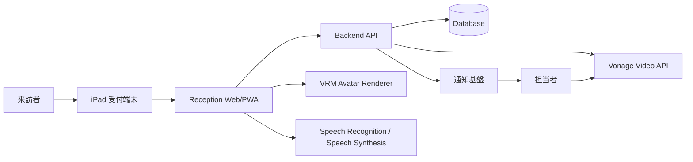
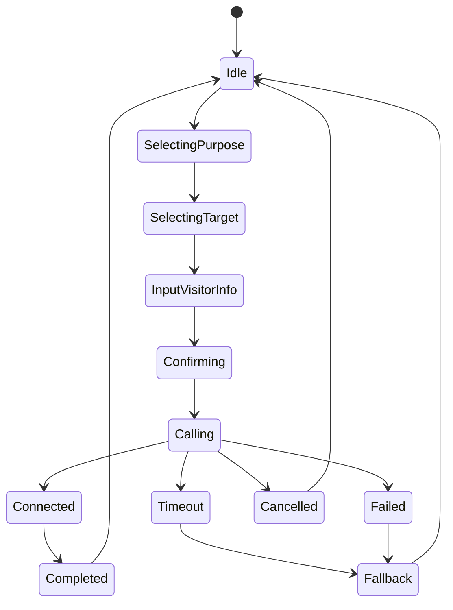

# Specification: open-reception

## 1. システム構成案



## 2. フロントエンド

### 2.1 想定技術

- TypeScript
- React / Next.js / Vite のいずれか
- three.js + VRM 表示ライブラリ
- Web Speech API または外部音声認識/音声合成サービス
- Vonage Web SDK
- Playwright による e2e テスト

### 2.2 画面

| 画面 | 内容 |
| --- | --- |
| 待機画面 | アバター、受付開始、案内文、端末状態 |
| 目的選択画面 | 面会、納品、採用面談、その他など |
| 担当者/部署選択画面 | 検索、候補、部署一覧 |
| 来訪者情報入力画面 | 氏名、会社名、要件、任意メモ |
| 確認画面 | 呼び出し先、入力内容、呼び出し開始 |
| 呼び出し中画面 | 進捗、キャンセル、待機案内 |
| 通話画面 | Vonage 通話 UI、終了、再呼び出し |
| 失敗/代替案内画面 | 応答なし、通信失敗、代替連絡先 |
| 完了画面 | 案内、待機画面へ自動復帰 |

## 3. バックエンド

### 3.1 責務

- 端末設定の取得
- 担当者/部署/呼び出し先の管理
- 受付セッションの作成
- Vonage セッション/トークン生成
- 通知送信
- 受付履歴・監査ログ保存
- 管理画面認証・認可

### 3.2 API 案

| Method | Path | 用途 |
| --- | --- | --- |
| GET | /api/kiosk/config | iPad 端末設定取得 |
| POST | /api/receptions | 受付セッション作成 |
| POST | /api/receptions/:id/call | 呼び出し開始 |
| POST | /api/receptions/:id/cancel | 来訪者キャンセル |
| POST | /api/receptions/:id/complete | 応対完了 |
| GET | /api/staff | 担当者検索 |
| GET | /api/departments | 部署一覧 |
| POST | /api/vonage/session | Vonage セッション/トークン発行 |
| GET | /api/admin/receptions | 受付履歴一覧 |
| POST | /api/admin/staff | 担当者作成 |
| PATCH | /api/admin/staff/:id | 担当者更新 |

## 4. データモデル案

### Staff

```ts
type Staff = {
  id: string;
  displayName: string;
  kana?: string;
  aliases: string[];
  departmentId: string;
  callTargets: CallTarget[];
  isAvailable: boolean;
  fallbackStaffIds: string[];
  createdAt: string;
  updatedAt: string;
};
```

### Department

```ts
type Department = {
  id: string;
  name: string;
  kana?: string;
  priority: number;
  defaultCallTargets: CallTarget[];
};
```

### ReceptionSession

```ts
type ReceptionSession = {
  id: string;
  kioskId: string;
  visitorName?: string;
  visitorCompany?: string;
  purpose: string;
  targetType: 'staff' | 'department' | 'manual';
  targetId: string;
  status: 'draft' | 'calling' | 'connected' | 'completed' | 'cancelled' | 'failed' | 'timeout';
  failureReason?: string;
  startedAt: string;
  completedAt?: string;
};
```

### CallTarget

```ts
type CallTarget = {
  type: 'vonage' | 'email' | 'slack' | 'phone' | 'webhook';
  value: string;
  priority: number;
  enabled: boolean;
};
```

## 5. 状態遷移



## 6. iPad 端末仕様

- Safari またはホーム画面追加 PWA で動作する
- 受付専用表示を前提に、大きなタッチターゲットを採用する
- ガイドアクセス/MDM/キオスク運用を想定する
- 画面向きは初期は横向きを推奨し、縦向き崩れも防ぐ
- マイク/カメラ権限が拒否された場合でも受付は継続できる
- スリープ復帰、ネットワーク復帰、再読み込み時に待機画面へ戻る
- 受付完了後は個人情報を画面上に残さない

## 7. 音声仕様

### 音声合成

- 初回タップ後に音声ガイダンスを有効化する
- 短文で案内する
- 画面文言と音声内容は矛盾させない
- 再生失敗時は UI のみで案内する

### 音声認識

- 担当者名、部署名、目的選択の補助に使う
- 認識結果は必ず候補表示し、来訪者のタッチ確認を挟む
- 誤認識による即時呼び出しは禁止する
- 音声認識不可時は検索/選択 UI に戻す

## 8. VRM 仕様

- 状態に応じた表情/モーションを持つ
- 音声合成中は口パクする
- iPad 負荷対策として FPS、ポリゴン、テクスチャ、ライトを制御する
- VRM が読み込めない場合は静止画像またはテキスト案内にフォールバックする

## 9. Vonage 仕様

- フロントエンドは短命トークンのみ受け取る
- セッション/トークン生成はサーバーで行う
- 受付端末と担当者間の通話セッションを作成する
- 通話前の担当者通知と通話開始を分離する
- タイムアウト、拒否、失敗、切断を状態として扱う
- 受付端末側に機密キーを置かない

## 10. エラー・フォールバック

| エラー | 対応 |
| --- | --- |
| ネットワーク断 | 再試行、手動受付案内、端末状態表示 |
| マイク拒否 | タッチ操作へ誘導 |
| カメラ拒否 | 音声/通知のみで呼び出し |
| Vonage 接続失敗 | 通知再送、代替連絡先、受付履歴に失敗記録 |
| 担当者未応答 | 代替担当者またはメッセージ入力へ |
| VRM 読込失敗 | 静止画像/テキスト UI に切替 |
| 音声合成失敗 | テキスト案内のみ |

## 11. 初期実装方針

1. iPad タッチ UI の受付フローを先に完成させる
2. 担当者/部署データは仮データから始める
3. 受付履歴を保存する
4. Vonage 呼び出しを接続する
5. 音声合成、VRM、音声認識を段階的に追加する
6. 管理画面、認可、監査ログを強化する
